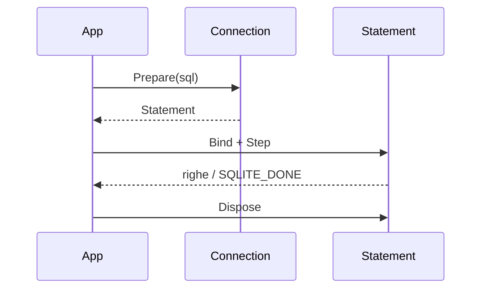
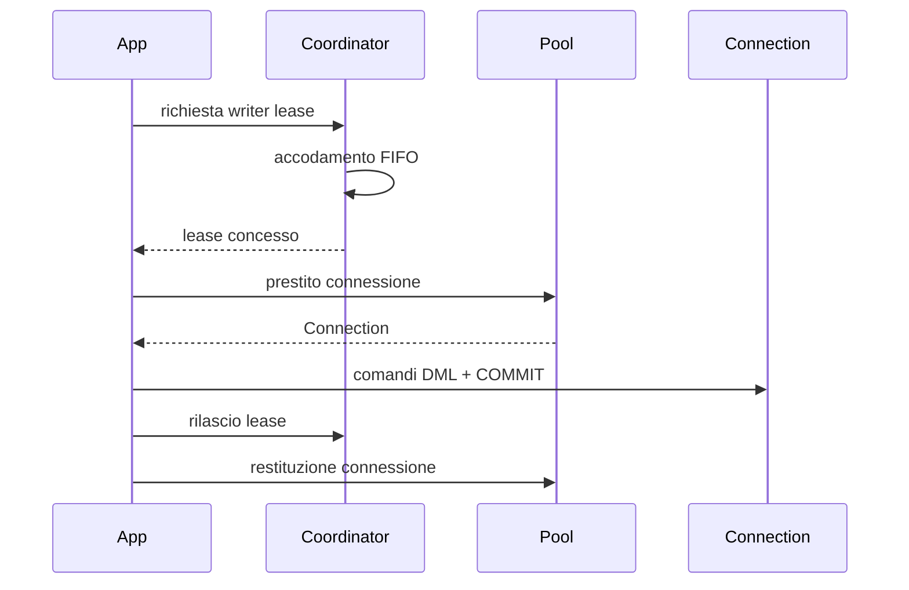

# Specifica architetturale enterprise per driver SQLite multi-linguaggio — interoperabilità nativa, superficie idiomatica e coordinamento applicativo

**Documento radice (Tier 0) — indipendente dal linguaggio di programmazione**

---

## Controllo del documento

| Campo | Valore |
|---|---|
| Codice documento | ARCH-SQLITE-LIB-001 |
| Titolo | Specifica architetturale enterprise per driver SQLite multi-linguaggio — interoperabilità nativa, superficie idiomatica e coordinamento applicativo |
| Versione | 6.0.0 |
| Stato | Bozza per revisione |
| Livello | Tier 0 — Specifica architetturale platform-independent |
| Classificazione | Interno — Uso tecnico |
| Documenti derivati (Tier 1) | Vedi §2.2 |

### Storico delle revisioni

| Versione | Descrizione modifiche |
|---|---|
| 1.0–5.0.0 | Vedi versioni precedenti del documento per lo storico completo. In sintesi: da bozza di lavoro monolingua (1.0) a specifica enterprise con governance, NFR e guida di derivazione (2.0.0); estensione da motore di coordinamento a libreria completa, con tassonomia errori, cache statement, flag di apertura, Backup/Checkpoint (3.0.0); elevazione di astrazione, dualità Sync/Async, multithreading e "modernità" a requisiti di primo livello (4.0.0); formalizzazione di nomenclatura cross-language, unificazione `ResultCode`/`BaseResultCode`, profili di flag denominati (5.0.0). |
| **6.0.0** | **Riposizionamento architetturale a tre livelli espliciti** (Interoperabilità C → Wrapper Idiomatico → Libreria di alto livello, nuova §8), con l'invariante di non-interferenza **I26** a garanzia che il Livello 3 non alteri mai il comportamento osservabile del Livello 2. Conseguenze principali: (1) **Streaming Result Cursor rimosso** come componente e come requisito — l'iterazione idiomatica avviene direttamente sopra Step/Bind/Column*, **I22 rimosso**; (2) **ConnectionPool, StatementCache e Single-Writer Coordinator diventano attivabili per modalità operativa**, non più sempre presenti in coppia fissa — nuove modalità **Native / Coordinated / ReadOnly** (§11) sostituiscono la vecchia coppia `ConcurrencyMode` (§18 precedente) × `OpenFlagsProfile` (§19.3 precedente); la modalità `Retry` è eliminata; **I9, I10, I11, I12, I13, I14, I16, I18, I25 riformulati** con perimetro esplicito per modalità; (3) **dualità Sync/Async ridefinita su due livelli**: Async normativo, vincolato dall'Execution Engine, solo in modalità Coordinated; Async "di comodo" facoltativo a Livello 2, a discrezione del Tier 1, non soggetto a conformità (§22); (4) **cancellazione a due meccanismi distinti**: interrupt nativo (`sqlite3_interrupt`) a Livello 2, token cooperativo a Livello 3 — **I21 riformulato**; (5) **JavaScript/Node.js rimosso** dall'elenco dei linguaggi di riferimento, presente e futuro, sostituito da **Swift**; conseguente rimozione della categoria "event loop cooperativo a thread singolo" e **I19 rimosso** (rischio residuo tracciato in §27); (6) i profili di flag di apertura denominati (§20) restano riservati alle modalità Coordinated/ReadOnly; la modalità Native usa flag di baseline dichiarati, mai un profilo con nome che evochi il pool. Aggiornati di conseguenza: scopo (§1), terminologia (§4), NFR (§5), vincoli (§6), filosofia (§7), vista dei componenti (§9), identità di database (§10), modello di concorrenza (§12), ciclo di vita connessione/statement (§14–15), tassonomia errori (§19), flag di apertura (§20), Backup/Checkpoint (§21), guida alla derivazione (§26, Swift al posto di JavaScript), registro dei rischi (§27), criteri di conformità (§28), matrice di tracciabilità (Appendice A). |

---

## Indice

1. Scopo e ambito
2. Governance documentale e relazione con i documenti derivati
3. Executive summary
4. Terminologia e glossario
5. Driver architetturali e requisiti di qualità (NFR)
6. Vincoli e assunzioni
7. Filosofia di progetto
8. Architettura a tre livelli
9. Vista dei componenti
10. Identità di database
11. Modalità operative
12. Modello di concorrenza: dal gate binario al coordinatore a canale
13. Classificazione dei comandi
14. Ciclo di vita di una connessione fisica
15. Ciclo di vita dello statement preparato e cache di preparazione
16. Transazioni e Savepoint
17. Algoritmo generale
18. Proprietà garantite
19. Tassonomia e gestione degli errori
20. Flag di apertura nativi e modalità di threading
21. Backup API e WAL Checkpoint
22. Modello di esecuzione Sync/Async
23. Multithreading e cancellazione
24. Invarianti di progettazione — contratto vincolante per ogni derivazione
25. Diagrammi di sequenza di riferimento
26. Guida alla derivazione per linguaggio
27. Registro dei rischi
28. Criteri di conformità e test di accettazione
29. Conclusione

Appendice A — Matrice di tracciabilità invarianti → sezioni → test

---

## 1. Scopo e ambito

### 1.1 Scopo

Questo documento definisce l'architettura di riferimento per la realizzazione di **driver SQLite di livello enterprise**, per linguaggi ad alto livello — C++, C#, Java, Python, Go, Swift. L'architettura è organizzata in **tre livelli** (§8): un livello di interoperabilità nativa, un livello di superficie idiomatica che ricalca fedelmente nomenclatura e funzionalità dell'API C di SQLite, e un livello opzionale che aggiunge pooling, caching e coordinamento delle scritture concorrenti.

Il termine "wrapper" è riservato, in questo documento, esclusivamente alla descrizione del secondo livello (§8); non è mai usato per descrivere il prodotto nel suo insieme, né compare in alcun nome di tipo pubblico (I23).

### 1.2 In ambito (in-scope)

- Il contratto minimo del livello di interoperabilità nativa: proiezione 1:1, mai comportamentale, della ABI C di SQLite (§8).
- La superficie idiomatica completa: connessione, statement, binding, stepping, lettura colonne, transazioni, savepoint, interruzione, backup, tassonomia degli errori (§8, §9).
- Il Connection Pool, la Statement Cache e il Single-Writer Coordination Engine, come componenti opzionali attivabili per modalità operativa (§9, §11, §12).
- La dualità comportamentale Sync/Async, differenziata per livello (§22).
- Il contratto di multithreading e cancellazione lato consumatore (§23).

### 1.3 Fuori ambito (out-of-scope)

- Qualunque forma di ORM, query builder o mapping oggetto-relazionale.
- Un tipo "cursore di risultato" come astrazione aggiuntiva sopra Step/Bind: l'iterazione idiomatica avvolge direttamente le primitive native, senza un ulteriore livello (§8, §22.3 rimossa in v6.0.0).
- JavaScript/Node.js, escluso dall'elenco dei linguaggi di riferimento in modo esplicito, presente e futuro; una sua eventuale riconsiderazione richiederebbe una nuova revisione major di questo documento.
- Coordinamento tra processi diversi: il Single-Writer Coordinator serializza scritture concorrenti **all'interno di un singolo processo**; la sincronizzazione multi-processo resta affidata ai meccanismi nativi di SQLite (WAL, locking di filesystem).

---

## 2. Governance documentale e relazione con i documenti derivati

### 2.1 Regola di versionamento

**MAJOR**: aggiunta, rimozione o riformulazione di un invariante (§24); cambio dell'elenco dei linguaggi di riferimento; ridefinizione di un componente architetturale esistente. **MINOR**: aggiunta di contenuto che non modifica un invariante esistente né restringe una garanzia già approvata. **PATCH**: correzioni editoriali, chiarimenti che non alterano il significato normativo.

### 2.2 Stato delle derivazioni

| Linguaggio | Documento Tier 1 | Stato |
|---|---|---|
| C# | `ARCH-SQLITE-LIB-002-CSHARP` | v4.0.0 esistente, basata su Tier 0 v5.0.0 — **da riallineare a questa versione 6.0.0** |
| C++ | — | Da avviare |
| Java | — | Da avviare |
| Python | — | Da avviare |
| Go | — | Da avviare |
| Swift | — | Da avviare — sostituisce JavaScript nell'elenco dei linguaggi di riferimento (§1.1) |

### 2.3 Denominazione della libreria di riferimento

Questo documento resta agnostico rispetto al nome di prodotto di ogni derivazione concreta; ciascun documento Tier 1 dichiara il proprio namespace/package/modulo (I23).

---

## 3. Executive summary

L'architettura separa nettamente **cosa la libreria espone** (Livello 2, sempre presente, fedele all'API nativa ma idiomatica per linguaggio) da **come la libreria gestisce le risorse sotto il cofano** (Livello 3, opzionale, attivabile per modalità operativa). Chi ha bisogno del controllo più diretto possibile su SQLite usa la modalità **Native** e ottiene la stessa superficie pubblica di chi usa **Coordinated**, ma senza pool, cache né coordinamento — nessuna delle due modalità richiede al consumatore di imparare due API diverse (I26). Il cuore ingegneristico del documento resta il **Single-Writer Coordination Engine**: non nasconde i limiti di SQLite sulle scritture concorrenti, li rende gestibili in modo prevedibile e senza `SQLITE_BUSY` spuri.

---

## 4. Terminologia e glossario

| Termine | Definizione |
|---|---|
| **Livello 1 — Interoperabilità C** | Proiezione 1:1, non comportamentale, della ABI C di SQLite (P/Invoke, JNI, cgo, ctypes, interop C++/Swift). Specifica solo in Tier 1 (§8). |
| **Livello 2 — Wrapper Idiomatico** | Superficie pubblica che ricalca funzionalità e nomenclatura native, espressa con i costrutti idiomatici del linguaggio target. Sempre presente, sempre sincrona per default (§8, §22). |
| **Livello 3 — Libreria di alto livello** | Connection Pool + Statement Cache + Single-Writer Coordinator, aggiunti sopra il Livello 2 senza alterarne il comportamento osservabile (I26). Attivabile per modalità operativa (§11). |
| **Modalità Native** | Nessun componente di Livello 3; il consumatore configura flag e parametri nativi direttamente (§11). |
| **Modalità Coordinated** | Pool + Cache + Coordinator, tutti e tre insieme (§11). |
| **Modalità ReadOnly** | Pool + Cache, senza Coordinator — non necessario in assenza di scritture (§11). |
| **Writer Lease** | Diritto esclusivo, per l'intera durata di una transazione, a eseguire scritture su una identità di database, concesso dal Coordinator (§12). |
| **Identità di database** | Chiave univoca (file canonicalizzato, nome di cache condivisa, o istanza privata in memoria) a cui è associato al più un bundle di Livello 3 (§10). |
| **Connessione logica / fisica** | La connessione fisica è l'handle nativo aperto; la connessione logica è ciò che il consumatore detiene — in Native coincidono, in Coordinated/ReadOnly la logica è un prestito dal pool (§14). |

---

## 5. Driver architetturali e requisiti di qualità (NFR)

| Driver | Descrizione |
|---|---|
| Idiomaticità | Ogni derivazione usa i costrutti naturali del proprio linguaggio, senza tradurre letteralmente pattern estranei (§26.1). |
| Fedeltà funzionale | Il Livello 2 non nasconde né sostituisce concetti nativi; li espone, non li reinterpreta (§8). |
| Separazione dei livelli | Nessuna funzionalità di Livello 3 è raggiungibile se non esplicitamente attivata dalla modalità operativa scelta (I26). |
| Efficienza | Nessun costo imposto a chi non ne ha bisogno — un consumatore Native non paga l'overhead di pool, cache o coordinamento. |
| Correttezza concorrenziale | Nessuna corsa critica, nessun deadlock, nessuna perdita di risorsa native sotto contesa (§24). |
| Portabilità cross-language | Lo stesso contratto comportamentale, non la stessa sintassi, in ogni derivazione (§26). |
| Testabilità | Ogni invariante ha un test di conformità traducibile (§28, Appendice A). |

---

## 6. Vincoli e assunzioni

- SQLite non è nativamente asincrono: ogni superficie Async, a qualunque livello, è una proiezione costruita sopra chiamate native bloccanti (§22).
- Il coordinamento applicativo copre un solo processo; il multi-processo resta responsabilità di SQLite stesso (§1.3).
- Il runtime target deve fornire, come minimo, thread bloccabili dal sistema operativo oppure un modello strutturalmente equivalente (goroutine M:N); nessun linguaggio di riferimento attuale richiede un trattamento a event loop cooperativo a thread singolo (§23.1) — vedi rischio residuo §27.

---

## 7. Filosofia di progetto

- **Niente magia**: ogni comportamento non ovvio è configurato esplicitamente, mai dedotto implicitamente da un default silente.
- **Tre livelli, un solo contratto pubblico**: il Livello 3 aggiunge, non sostituisce; può introdurre propri tipi pubblici aggiuntivi, ma non altera mai il comportamento di quelli di Livello 2 (I26).
- **Fedeltà all'API nativa**: nomi e funzionalità del Livello 2 rispecchiano l'API C, proiettati nei limiti idiomatici del linguaggio (I23) — non è un'astrazione che nasconde SQLite, è SQLite vestito idiomaticamente.
- **Il coordinamento è un'aggiunta dichiarata, non un default nascosto**: chi vuole il comportamento puro di SQLite lo ottiene con la modalità Native, senza sorprese (§11).

---

## 8. Architettura a tre livelli

```
┌─────────────────────────────────────────────────────┐
│ Livello 3 — Libreria di alto livello (opzionale)     │
│ ConnectionPool · StatementCache · Single-Writer      │
│ Coordinator — attivati per modalità operativa (§11)  │
├─────────────────────────────────────────────────────┤
│ Livello 2 — Wrapper Idiomatico (sempre presente)     │
│ Connection · Statement · Backup · Step/Bind/Column*  │
│ · Transazioni/Savepoint · Tassonomia errori          │
├─────────────────────────────────────────────────────┤
│ Livello 1 — Interoperabilità C (per piattaforma)     │
│ Solo P/Invoke, JNI, cgo, ctypes, interop nativo       │
└─────────────────────────────────────────────────────┘
```

**Livello 1.** Unico vincolo Tier 0: è una proiezione 1:1 della ABI C di SQLite, mai comportamentale — nessuna logica applicativa, solo marshalling e gestione handle. Ogni altro dettaglio (gestione memoria, sicurezza dei tipi, risoluzione della libreria nativa) è specifico di piattaforma e va documentato interamente nel Tier 1.

**Livello 2 — Wrapper Idiomatico.** Espone connessione, statement, backup, transazioni/savepoint, tassonomia errori, interruzione nativa — un'unica superficie pubblica, identica in forma sia sotto Native sia sotto Coordinated/ReadOnly (I26). Nessun tipo cursore dedicato: l'iterazione idiomatica avvolge direttamente Step/Bind/Column* (§22.3 della v5.0.0 è rimossa; niente `IEnumerable<T>`/`List<T>` o equivalenti imposti da Tier 0). Sincrono per default; un'eventuale superficie Async qui è "di comodo", opzionale, a discrezione del Tier 1 (§22).

**Livello 3 — Libreria di alto livello.** Aggiunge Connection Pool, Statement Cache e Single-Writer Coordinator come bundle attivato dalla modalità operativa (§11), senza mai introdurre un secondo modo di usare gli stessi concetti del Livello 2. Può aggiungere propri tipi pubblici (es. un facade di connessione con prestito/rilascio), ma questi non intaccano il comportamento dei tipi di Livello 2 (I26).

---

## 9. Vista dei componenti

| Componente | Livello | Cardinalità | Responsabilità |
|---|---|---|---|
| Connection (fisica) | L2 | 1 per handle nativo aperto | Rappresenta una connessione SQLite aperta; espone Execute/Prepare/transazioni/interrupt. |
| Statement | L2 | 1 per `sqlite3_stmt` compilato | Step/Bind/Reset/ClearBindings/Column*, 1:1 con l'API nativa. |
| Backup | L2 | 1 per operazione di backup online | Avvolge `sqlite3_backup_*`; richiede due connessioni dedicate, mai dal pool (I17). |
| Connection Pool | L3 | 0 o 1 per identità di database (§10, §11) | Presta/recupera connessioni fisiche; attivo in Coordinated e ReadOnly. |
| Statement Cache | L3 | 0 o 1 per connessione fisica gestita dal pool | Riusa statement compilati tra prestiti successivi; attiva solo se il Pool è attivo. |
| Single-Writer Coordinator | L3 | 0 o 1 per identità di database | Serializza le scritture in ordine FIFO; attivo solo in modalità Coordinated. |
| Execution Engine | L3 | 1 per Coordinator attivo | Unica implementazione condivisa tra proiezione Sync e superficie Async normativa (§22). |

---

## 10. Identità di database

Ogni identità di database (file canonicalizzato, nome di cache condivisa, istanza privata in memoria) determina al più un bundle di Livello 3, mai condiviso tra identità diverse né duplicato per la stessa identità (I10). La canonicalizzazione di percorso (symlink, case-insensitivity del filesystem) resta responsabilità del Tier 1 (rischio tracciato in §27). L'incrocio identità × modalità operativa è normato in §11.

---

## 11. Modalità operative

Sostituisce la precedente coppia `ConcurrencyMode` × `OpenFlagsProfile` (v5.0.0) con tre modalità mutuamente esclusive, ciascuna una combinazione dichiarata di attivazione dei componenti di Livello 3:

| Modalità | Pool | Cache | Coordinator | Descrizione |
|---|---|---|---|---|
| **Native** | No | No | No | Solo Livello 2. Il consumatore gestisce flag e parametri nativi direttamente; nessun intervento della libreria oltre ai flag di baseline (§20). |
| **Coordinated** | Sì | Sì | Sì | Libreria di alto livello completa. Scritture serializzate in ordine FIFO (§12). |
| **ReadOnly** | Sì | Sì | No | Pool di sole connessioni in lettura; nessuna scrittura possibile, quindi nessun coordinamento necessario. |

La modalità `Retry` (v5.0.0) è eliminata: non ha un ruolo distinto una volta che Native è pienamente autonoma e Coordinated copre il caso enterprise. Il profilo `PoolConnectionFullMutexFallback` (v5.0.0) non è più una modalità: se `sqlite3_threadsafe()` rileva build Serialized, la libreria applica automaticamente `FULLMUTEX` al posto di `NOMUTEX` nel profilo attivo, come deviazione loggata e tracciata a registro rischi (§27), non come scelta esposta al consumatore.

### Matrice identità × modalità

| Identità | Native | Coordinated | ReadOnly |
|---|---|---|---|
| File su disco | ✅ | ✅ (caso di riferimento) | ✅ |
| Cache condivisa in memoria | ✅ | ⚠️ interazione `SHAREDCACHE`↔Coordinator da validare separatamente (rischio ereditato da v5.0.0, §27) | ✅ |
| Istanza privata in memoria | ✅ | ✅ (pool degenere a una connessione; la fairness FIFO tra transazioni logiche in coda resta utile) | ❌ non ammessa — un'istanza privata in sola lettura è permanentemente vuota e non popolabile |

---

## 12. Modello di concorrenza: dal gate binario al coordinatore a canale

*(Applicabile esclusivamente alla modalità Coordinated, §11.)*

La prima iterazione di questo motore usava un semplice gate binario (mutex) per serializzare le scritture: corretto ma non equo (nessun ordine di ammissione garantito) e non componibile con l'Async. L'iterazione enterprise sostituisce il gate con un **coordinatore a canale**: le richieste di scrittura si accodano in ordine FIFO (I8) e ricevono un **writer lease** che copre l'intera transazione — dal primo comando DML fino a `COMMIT`/`ROLLBACK` incluso, non il singolo comando (I1). Concedere il lease per singolo comando è l'errore concettuale più insidioso di questa architettura: apparentemente corretto, ma vanifica l'atomicità applicativa che il coordinatore dovrebbe garantire.

---

## 13. Classificazione dei comandi

Ogni statement preparato è classificato **read-only** o **write** in base a `sqlite3_stmt_readonly()`, calcolato una sola volta e mai ricalcolato (I9, condizionato alla presenza della Statement Cache). Solo i comandi write richiedono un writer lease in modalità Coordinated; in ReadOnly nessun comando write è ammesso a monte.

---

## 14. Ciclo di vita di una connessione fisica

Stati: `Created → Configuring → Idle → Leased → Active → Poisoned → Closed`. Gli stati `Leased` e `Poisoned` esistono solo quando un Pool è attivo (Coordinated/ReadOnly, I10, I14); in modalità Native una connessione fisica non transita mai per `Leased`: è aperta, usata e chiusa direttamente dal consumatore, e un errore fatale si traduce in un'eccezione senza stato interno di poisoning. Al rientro nel pool, una connessione `Idle` non ha transazioni pendenti né stato di sessione residuo (I7): rollback difensivo e reset di ogni `PRAGMA` di sessione non-default (es. `read_uncommitted`).

---

## 15. Ciclo di vita dello statement preparato e cache di preparazione

*(Applicabile quando la Statement Cache è attiva — Coordinated o ReadOnly, §11.)*

Uno statement in cache appartiene esattamente a una connessione fisica, mai condiviso tra connessioni (I11). È sempre sottoposto a `sqlite3_reset` + `sqlite3_clear_bindings` prima di un nuovo binding (I12). La cache è bounded, con eviction (tipicamente LRU) che finalizza sempre lo statement espulso (I13); il poisoning di una connessione implica lo svuotamento integrale della sua cache, senza migrazione a una connessione sostitutiva (I14). In modalità Native, il consumatore prepara, esegue e finalizza gli statement direttamente: nessun automatismo di reset o di limite di cache è imposto dalla libreria.

---

## 16. Transazioni e Savepoint

Concetto nativo, esposto idiomaticamente al Livello 2 in ogni modalità. La pila dei Savepoint non contiene mai nomi duplicati; `Release`/`RollbackTo` operano solo su nomi effettivamente presenti al momento della chiamata (I4). In modalità Coordinated, l'intera transazione — inclusi eventuali savepoint annidati — è coperta da un solo writer lease (§12).

---

## 17. Algoritmo generale

**Coordinated (scrittura)**: richiesta di lease → accodamento FIFO → concessione → esecuzione dei comandi della transazione → `COMMIT`/`ROLLBACK` → rilascio lease e restituzione della connessione al pool.

**Native**: nessun passaggio intermedio — il consumatore esegue direttamente sulla connessione che detiene.

**ReadOnly**: prestito di una connessione dal pool → esecuzione → restituzione; nessun lease, nessuna coda.

---

## 18. Proprietà garantite

- Nessuna doppia allocazione di una connessione fisica (I2, dove il pool è attivo).
- Rilascio garantito di ogni risorsa acquisita, anche in presenza di eccezioni (I5).
- Nessun lock thread-affine attraverso un punto di sospensione cooperativa (I6, superficie Async normativa).
- Il Livello 3 non altera mai il comportamento osservabile del Livello 2 (I26).

---

## 19. Tassonomia e gestione degli errori

Ogni connessione fisica è aperta con i codici di risultato estesi già attivi (`SQLITE_OPEN_EXRESCODE`), incluso in modalità Native — è un flag di baseline, non un'opzione di Livello 3 (I24, §20). `ResultCode` espone la granularità estesa; `BaseResultCode` è sempre derivato per mascheramento del byte meno significativo, mai da una tabella di lookup separata (I24). In caso di apertura fallita, il messaggio nativo va letto **prima** di chiudere l'handle non valido, altrimenti diventa irrecuperabile. Il protocollo di poisoning (§14) si applica solo dove esiste un pool da cui evitare il riuso di una connessione compromessa.

---

## 20. Flag di apertura nativi e modalità di threading

**Flag di baseline (sempre applicati, ogni modalità)**: `URI`, `EXRESCODE`, `busy_timeout` di default, e il flag di threading (`NOMUTEX`, salvo fallback automatico a `FULLMUTEX` su build Serialized rilevata, §11) — mai lasciati al default silente della build nativa collegata (I15). In modalità Native questi sono gli unici flag imposti dalla libreria: il resto è responsabilità del chiamante.

**Profili denominati (solo Coordinated/ReadOnly, I25)**: un piccolo insieme chiuso e tracciabile, mai una combinazione costruita inline nel punto di apertura — es. profilo per scrittura/lettura su file, profilo per cache condivisa, profilo per istanza privata in memoria. Il nome di questi profili non deve mai coincidere con il nome di una modalità operativa (§11), per evitare l'ambiguità lessicale che questa stessa revisione ha corretto rispetto a v5.0.0.

---

## 21. Backup API e WAL Checkpoint

Il backup online (`sqlite3_backup_*`) è un componente di Livello 2 puro: non richiede pool né coordinamento, ma usa sempre una connessione dedicata, mai presa dal pool ordinario né titolare di un writer lease attivo (I17) — questa disciplina è responsabilità di chi invoca l'operazione, non del tipo `Backup` stesso.

Il checkpoint WAL bloccante (`FULL`/`RESTART`/`TRUNCATE`) è instradato attraverso il Coordinator solo in modalità Coordinated (I16); in Native è un `PRAGMA` che il consumatore invoca direttamente senza garanzia di ordinamento con altre scritture; in ReadOnly non si applica (nessuna scrittura, nessun checkpoint necessario).

---

## 22. Modello di esecuzione Sync/Async

SQLite non è nativamente asincrono: ogni superficie Async è una proiezione costruita sopra chiamate native bloccanti. Questa revisione distingue esplicitamente due categorie:

- **Async normativo (Livello 3, solo Coordinated)**: proiezione dell'Execution Engine condiviso — la superficie Sync è sempre un'attesa bloccante sulla stessa chiamata Async, mai una logica di coordinamento indipendente (I18). Ha senso qui perché l'attesa del turno in coda può essere reale e non banale: sospendere cooperativamente invece di occupare un thread è un vantaggio architetturale concreto.
- **Async "di comodo" (Livello 2, opzionale)**: un semplice offload della chiamata nativa bloccante su un thread separato, senza Execution Engine né garanzie di fairness — utile solo per operazioni intrinsecamente lunghe indipendentemente dal coordinamento (es. `Backup.Step` su molte pagine). Offrirla o meno è discrezione del Tier 1; non è soggetta a test di conformità (§28).

L'idoneità del runtime target alla superficie Sync bloccante resta normata per due sole categorie: thread bloccabili dal sistema operativo (normativa) e modello strutturalmente equivalente a goroutine M:N (Go). Nessuna terza categoria per event loop cooperativo a thread singolo è più portata da Tier 0 (§1.3, §27); un'eventuale classificazione ibrida (es. per un runtime con pool cooperativo e thread OS pienamente bloccabili) è demandata interamente al Tier 1 interessato.

---

## 23. Multithreading e cancellazione

Ogni tipo pubblico dichiara esplicitamente, nel documento derivato, il proprio contratto di thread-affinity (I20) — nessun tipo è thread-safe per omissione della dichiarazione.

**Cancellazione a due meccanismi, coerenti col livello (I21)**:
- **Livello 2**: interruzione nativa via `sqlite3_interrupt`, esposta idiomaticamente (già presente come metodo `Interrupt()` nella superficie Connection) — agisce a grana di connessione, termina l'operazione bloccante in corso con `SQLITE_INTERRUPT`. Nessun `CancellationToken` iniettato nelle firme del Wrapper Idiomatico.
- **Livello 3**: cancellazione cooperativa via token, applicata al turno in coda presso il Coordinator o a un'attesa Async normativa — raggiunge ogni punto di sospensione attraversato, senza tratti non cancellabili.

---

## 24. Invarianti di progettazione — contratto vincolante per ogni derivazione

Ogni Tier 1 deve dimostrare, con un test concreto, la conformità a ciascun invariante attivo (Appendice A). Gli invarianti I1–I18, I20–I21, I23–I26 sono attivi in questa versione; **I19 e I22 sono rimossi** (motivazione sotto).

1. **I1 — Unicità del writer, a livello di transazione** *[Coordinated]*: per ogni identità, al più un writer lease è concesso in un dato istante, e resta detenuto dalla stessa transazione per l'intera sua durata (§12).
2. **I2 — Nessuna doppia allocazione** *[Coordinated, ReadOnly]*: una connessione fisica non è mai simultaneamente libera nel pool e in uso.
3. **I3 — Coerenza Affinity/lease** *[Coordinated]*: `Affinity == Writer` implica esattamente un lease outstanding per quella transazione.
4. **I4 — Integrità della pila Savepoint** *[Universale, L2]*: nessun nome duplicato; operazioni solo su nomi presenti.
5. **I5 — Rilascio garantito** *[Universale]*: ogni risorsa acquisita è rilasciata esattamente una volta, anche con eccezioni.
6. **I6 — Nessun lock thread-affine attraverso un punto di sospensione** *[Coordinated, Async normativo]*: solo primitive compatibili con sospensione cooperativa; l'Async di comodo di Livello 2 non attraversa punti di sospensione e non è soggetto a questo vincolo.
7. **I7 — Connessione neutra al rientro nel pool** *[Coordinated, ReadOnly]*: nessuna transazione pendente né stato di sessione residuo.
8. **I8 — Fairness FIFO** *[Coordinated]*: l'ordine di ammissione al canale coincide con l'ordine di esecuzione dei turni.
9. **I9 — Classificazione stabile** *[condizionato: Statement Cache attiva]*: `sqlite3_stmt_readonly()` calcolato una sola volta per statement, mai ricalcolato.
10. **I10 — Unicità del bundle di Livello 3 per identità e modalità** *[Coordinated, ReadOnly]*: ogni identità in Coordinated ha esattamente una tripla (Pool, Cache, Coordinator); ogni identità in ReadOnly ha esattamente una coppia (Pool, Cache) senza Coordinator; mai condivisi tra identità diverse; il factory non è eseguito più di una volta per identità+modalità nemmeno in accesso concorrente.
11. **I11 — Appartenenza esclusiva dello statement in cache** *[condizionato: cache attiva]*: appartiene esattamente a una connessione fisica.
12. **I12 — Reset obbligatorio prima del rebind** *[condizionato: cache attiva]*: sempre `sqlite3_reset` + `sqlite3_clear_bindings` prima di un nuovo binding; in Native questa disciplina è responsabilità del chiamante.
13. **I13 — Cache limitata senza leak nativi** *[condizionato: cache attiva]*: bounded, eviction che finalizza sempre lo statement espulso.
14. **I14 — Poisoning implica svuotamento della cache** *[condizionato: pool attivo]*: finalizzazione integrale, nessuna migrazione a connessione sostitutiva; il concetto di poisoning non esiste in Native.
15. **I15 — Modalità di threading e flag di apertura dichiarati esplicitamente** *[Universale]*: mai Single-thread; `NOMUTEX` sotto Multi-thread, o `FULLMUTEX` come deviazione dichiarata e tracciata.
16. **I16 — Checkpoint bloccante instradato dal coordinatore** *[Coordinated]*: `FULL`/`RESTART`/`TRUNCATE` sempre come turno one-shot nel canale; in Native è un `PRAGMA` diretto senza garanzia di ordinamento.
17. **I17 — Backup su connessione dedicata** *[Universale]*: mai una connessione presa dal pool ordinario né titolare di un writer lease.
18. **I18 — Unicità dell'Execution Engine tra le superfici Sync e Async** *[Coordinated, Async normativo]*: la superficie Sync non implementa mai un coordinamento indipendente; l'Async di comodo di Livello 2, non avendo un Execution Engine, non è soggetto a questo vincolo.
19. **I19 — Rimosso in v6.0.0.** Nessun linguaggio di riferimento attuale ha un runtime a event loop cooperativo a thread singolo dopo l'uscita di JavaScript (§1.1, §2.2); principio non più portato come invariante testabile. Rischio residuo accettato e tracciato (§27): un'eventuale derivazione futura con questo modello richiederebbe una nuova revisione major.
20. **I20 — Contratto di thread-affinity dichiarato per ogni tipo pubblico** *[Universale]*: nessun tipo è thread-safe per omissione della dichiarazione.
21. **I21 — Cancellazione coerente col livello** *[Universale, meccanismo diverso per livello]*: a Livello 3, un token cooperativo raggiunge ogni punto di sospensione (coda del coordinatore, attesa async normativa); a Livello 2, l'interruzione avviene sempre e solo tramite `sqlite3_interrupt` esposto idiomaticamente, mai tramite token nella firma dei metodi del Wrapper Idiomatico.
22. **I22 — Rimosso in v6.0.0.** Lo streaming incrementale del result set non è più un requisito architetturale vincolante: l'iterazione idiomatica avvolge direttamente Step/Bind/Column*, senza un tipo cursore dedicato (§8); resta un effetto emergente della scelta idiomatica di ogni Tier 1, non più garantito da Tier 0.
23. **I23 — Nomenclatura senza prefisso ridondante e aderente alla API nativa** *[Universale]*: nessun prefisso ridondante salvo collisione reale documentata; il termine "wrapper" è riservato alla descrizione del Livello 2, mai al nome del prodotto o di un tipo pubblico di Livello 3.
24. **I24 — `ResultCode` sempre esteso, `BaseResultCode` sempre derivato per mascheramento** *[Universale, L2]*: `EXRESCODE` è flag di baseline in ogni modalità, inclusa Native.
25. **I25 — Profili di flag di apertura denominati** *[Coordinated, ReadOnly]*: mai una combinazione costruita inline; in Native l'insieme di flag applicativi è responsabilità del chiamante, fatti salvi i flag di baseline (§20).
26. **I26 — Layering non interferente** *[Universale, nuovo]*: il Livello 3 non altera mai il comportamento osservabile del Livello 2; le uniche differenze ammesse sono la provenienza della connessione fisica (dal pool vs. aperta direttamente) e l'eventuale attesa per il writer lease.

---

## 25. Diagrammi di sequenza di riferimento

**Native — statement autocommit**



**Coordinated — transazione di scrittura**



---

## 26. Guida alla derivazione per linguaggio

### 26.1 Convenzioni di nomenclatura cross-language

Nomi autoesplicativi, aderenti alla terminologia nativa dove sensato, senza prefisso ridondante già implicito nel namespace/package/modulo (I23).

### 26.2 Requisito di piattaforma per l'ammissibilità

Ogni Tier 1 dichiara esplicitamente quale delle due categorie normative si applica al proprio runtime: thread OS bloccabili, o modello strutturalmente equivalente a goroutine M:N. Un'eventuale nota su modelli ibridi (es. cooperative thread pool convivente con thread OS pienamente bloccabili) è interamente a discrezione e responsabilità del Tier 1.

### 26.3 Tabella di mappatura delle primitive astratte (estratto)

| Concetto Tier 0 | Livello | Forma Sync | Forma Async |
|---|---|---|---|
| Connection | L2 | Tipo con ciclo di vita esplicito | — (salvo Async di comodo, discrezionale) |
| Statement.Step | L2 | Chiamata bloccante | — (salvo Async di comodo, discrezionale) |
| Writer lease | L3 (Coordinated) | Attesa bloccante | Proiezione dell'Execution Engine (normativa) |
| Cancellazione L2 | L2 | `sqlite3_interrupt` idiomatico | stesso meccanismo |
| Cancellazione L3 | L3 | Token cooperativo | Token cooperativo |

### 26.4 Contenuti minimi obbligatori di un documento Tier 1

1. Dichiarazione completa del Livello 1 (meccanismo di interoperabilità, gestione handle, marshalling).
2. Tabella di conformità a ciascun invariante attivo (§24), con test eseguibile.
3. Dichiarazione esplicita di thread-affinity per ogni tipo pubblico (I20).
4. Dichiarazione se e come è offerto l'Async di comodo di Livello 2 (§22), se offerto.
5. Classificazione del runtime secondo §26.2.

---

## 27. Registro dei rischi

| Rischio | Probabilità | Impatto | Mitigazione |
|---|---|---|---|
| Il lease viene accodato per singolo comando anziché per l'intera transazione (violazione I1). | Media-Alta | Alto | Test di conformità I1 obbligatorio (Appendice A). |
| Interazione `SHAREDCACHE`↔Coordinator non validata in modalità Coordinated (§11, matrice). | Media | Medio | Validazione tecnica dedicata richiesta prima di dichiarare supportata questa combinazione. |
| Un'implementazione confonde il meccanismo di cancellazione di Livello 2 (`sqlite3_interrupt`) con quello di Livello 3 (token), iniettando un token anche nelle firme del Wrapper Idiomatico (violazione I21, I26). | Media | Medio | Revisione statica; test che verifichi l'assenza di parametri di cancellazione nelle firme di Livello 2. |
| Il Livello 3 altera il comportamento osservabile di un tipo di Livello 2 (violazione I26), tipicamente introducendo un side-effect solo quando il pool è attivo. | Media | Alto — comportamento diverso a seconda della modalità, difficile da diagnosticare. | Test di conformità I26: stessa sequenza di operazioni sotto Native e sotto Coordinated, verifica di esito identico salvo provenienza della connessione. |
| Un canonicalizzazione di identità non rigorosa su filesystem case-insensitive o con symlink (violazione I10). | Media | Medio | Risoluzione demandata esplicitamente al Tier 1 (§10). |
| Una build nativa collegata è già Single-thread, in conflitto con I15. | Bassa-Media | Alto | Verifica obbligatoria di `sqlite3_threadsafe()` in apertura, fallimento esplicito. |
| Un linguaggio futuro richiede un modello a event loop cooperativo a thread singolo, non più coperto da un invariante dopo la rimozione di I19. | Bassa | Medio — richiederebbe una nuova revisione major per essere riaccolto. | Rischio accettato esplicitamente in questa versione (§1.3); nessuna mitigazione preventiva. |
| Uno statement estratto dalla cache viene rieseguito senza reset/clear-bindings preventivo (violazione I12). | Media | Alto | Test di conformità I12 (Appendice A). |
| La Statement Cache cresce senza limite o l'eviction non finalizza lo statement espulso (violazione I13). | Bassa-Media | Alto sotto carico prolungato | Test di conformità I13 (Appendice A). |
| Un checkpoint bloccante invocato fuori dal canale del coordinatore in modalità Coordinated (violazione I16). | Media | Alto | Test di conformità I16 (Appendice A). |
| La superficie Sync duplica indipendentemente la logica di coordinamento invece di proiettare l'Execution Engine (violazione I18). | Media | Alto | Test strumentato di conformità I18 (Appendice A). |
| Un tipo pubblico dichiarato "thread-safe" senza contratto esplicito (violazione I20). | Media | Medio-Alto | Requisito esplicito §26.4 punto 3. |
| Una connessione aperta senza `EXRESCODE`, o `BaseResultCode` implementato con tabella separata anziché mascheramento (violazione I24). | Media | Medio-Alto | Test di conformità I24; revisione statica del codice di proiezione. |
| Un profilo di flag denominato usato in modalità Native, o un nome di profilo che coincide con un nome di modalità operativa (violazione I25, confusione lessicale). | Media | Medio | Revisione statica; nomi di profilo e di modalità mantenuti in insiemi lessicali disgiunti (§20). |

---

## 28. Criteri di conformità e test di accettazione

| Invariante | Test di conformità (sintesi) |
|---|---|
| I1 | Due transazioni concorrenti: la seconda scrittura attende il commit/rollback della prima, mai solo il primo comando; nessun `SQLITE_BUSY` spurio. |
| I4 | Savepoint A → B → Release A: B non più referenziabile; secondo Release su A solleva errore. |
| I5 | Iniezione di eccezione a metà chiusura transazione: lease e slot pool comunque rilasciati. |
| I6 | Revisione statica automatizzata: nessun locking thread-affine nel namespace del coordinatore. |
| I7 | Transazione `ReadUncommitted`, poi nuova connessione dal pool: stato di sessione tornato al default. |
| I8 | Più richieste concorrenti: ordine di esecuzione coincide con ordine di ammissione. |
| I9 | Statement riusato più volte dalla cache: classificazione read-only/write invariata. |
| I10 | Accesso concorrente alla prima apertura di un'identità: un solo bundle costruito. |
| I11 | Ogni `CachedStatement` referenzia esclusivamente la propria connessione fisica. |
| I12 | Esecuzione con parametro A, poi B sullo stesso statement in cache: effetto riflette B. |
| I13 | Inserimento oltre la capacità massima: limite rispettato, statement espulso finalizzato. |
| I14 | Poisoning di una connessione: cache svuotata integralmente, nessuna migrazione. |
| I15 | `sqlite3_threadsafe()` verificato in apertura; fallimento esplicito se Single-thread. |
| I16 | Checkpoint `FULL` concorrente a una scrittura: la scrittura attende in ordine FIFO. |
| I17 | Backup sempre su connessione dedicata, mai dal pool né con Affinity Writer attiva. |
| I18 | Contatore strumentato: chiamata Sync ed equivalente Async attraversano lo stesso punto di accodamento. |
| I20 | Ogni tipo pubblico elencato in §9 compare nella tabella di thread-affinity del Tier 1. |
| I21 | A Livello 2, cancellazione solo via `sqlite3_interrupt`; a Livello 3, token cooperativo raggiunge ogni punto di sospensione, verificato con contatore strumentato. |
| I23 | Revisione statica: nessun prefisso ridondante senza motivazione documentata; nessun uso del termine "wrapper" nel nome del prodotto o di un tipo pubblico. |
| I24 | Errore con sotto-categoria nota: granularità estesa presente; proiezione a `BaseResultCode` per mascheramento (revisione statica). |
| I25 | Ogni apertura in Coordinated/ReadOnly referenzia un profilo denominato; nessuna combinazione inline. |
| I26 | Stessa sequenza di operazioni sotto Native e sotto Coordinated: esito identico salvo provenienza della connessione. |

---

## 29. Conclusione

Questa revisione non restringe alcuna garanzia approvata nelle versioni precedenti: la ridistribuisce su tre livelli espliciti, in modo che ogni consumatore paghi solo il costo delle funzionalità che sceglie di attivare. Il Single-Writer Coordination Engine resta il componente ingegneristicamente più delicato del documento — non nasconde i limiti di SQLite sulla scrittura concorrente, li rende gestibili in modo prevedibile — ma ora è una scelta dichiarata (`Coordinated`), non un default implicito. I linguaggi di riferimento restano C++, C#, Java, Python, Go, Swift (§1.1, §2.2).

---

## Appendice A — Matrice di tracciabilità invarianti → sezioni → test

| Invariante | Sezione di definizione | Test di conformità (§28) |
|---|---|---|
| I1 | §12, §24 | §28 |
| I2 | §24 | Implicito nella struttura del pool (§9) |
| I3 | §16, §24 | Verifica di stato Affinity/lease |
| I4 | §16, §24 | §28 |
| I5 | §19, §24 | §28 |
| I6 | §12, §24 | §28 |
| I7 | §14, §24 | §28 |
| I8 | §12, §24 | §28 |
| I9 | §13, §15, §24 | §28 |
| I10 | §10, §24 | §28 |
| I11 | §15, §24 | §28 |
| I12 | §15, §24 | §28 |
| I13 | §15, §24 | §28 |
| I14 | §14, §15, §24 | §28 |
| I15 | §20, §24 | §28 |
| I16 | §21, §24 | §28 |
| I17 | §21, §24 | §28 |
| I18 | §22, §24 | §28 |
| I19 | §24 — **rimosso in v6.0.0** | N/A |
| I20 | §23, §24 | §28 |
| I21 | §23, §24 | §28 |
| I22 | §24 — **rimosso in v6.0.0** | N/A |
| I23 | §26.1, §24 | §28 |
| I24 | §19, §24 | §28 |
| I25 | §20, §24 | §28 |
| I26 | §8, §24 | §28 |
