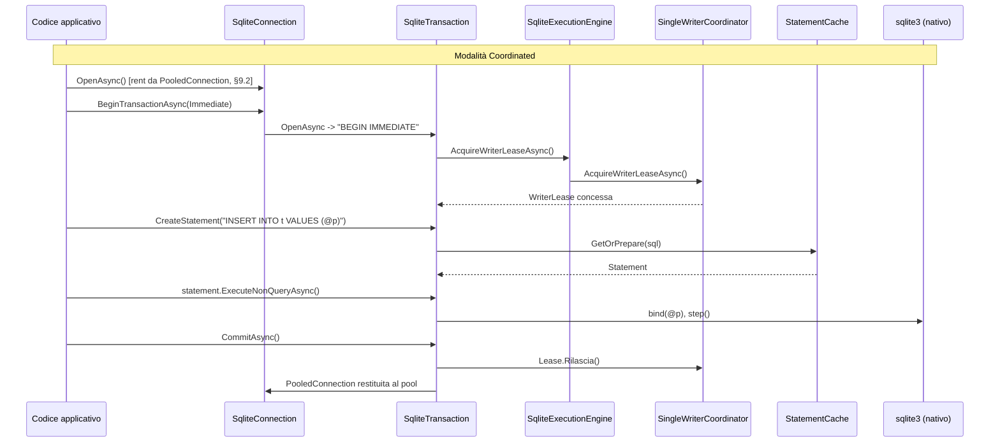

# CiccioSoft.Sqlite — Derivazione C#/.NET del driver SQLite enterprise a tre livelli

**Documento derivato — Tier 1 — Derivazione linguistica: C# / .NET**

---

## Controllo del documento

| Campo | Valore |
|---|---|
| Codice documento | ARCH-SQLITE-LIB-002-CSHARP |
| Titolo | CiccioSoft.Sqlite — Derivazione C#/.NET dell'architettura di riferimento a tre livelli |
| **Nome libreria** | **CiccioSoft.Sqlite** (§2.3 Tier 0) |
| Allineato a | `ARCH-SQLITE-LIB-001` **v6.0.0** ("Specifica architetturale enterprise per driver SQLite multi-linguaggio — interoperabilità nativa, superficie idiomatica e coordinamento applicativo") |
| Versione | 5.0.0 |
| Stato | Bozza per revisione |
| Livello | Tier 1 — Derivazione linguistica (C# / .NET) |
| Classificazione | Interno — Uso tecnico |
| **Requisiti minimi di piattaforma** | **SDK .NET 10.0** (minimo); **C# 14** — dettaglio in §1.2 |
| Artefatti distribuibili | `CiccioSoft.Sqlite` |
| Repository | `github.com/FrancescoCrimi/CiccioSoft.Sqlite` |

### Storico delle revisioni

| Versione | Descrizione modifiche |
|---|---|
| 1.0.0–4.0.0 | Vedi versioni precedenti per lo storico completo. In sintesi: prima redazione allineata a Tier 0 v3.0.0 con cache di preparazione, tassonomia errori, selezione libreria nativa, Backup/Checkpoint (1.0.0); riallineamento a Tier 0 v4.0.0 con rimozione della derivazione da `System.Data.Common`, `SqliteExecutionEngine`, `SqliteResultCursor`, contratto di thread-affinity (2.0.0); riallineamento a Tier 0 v5.0.0 con `ResultCode`/`BaseResultCode` unificati, `SqliteTransactionMode` al posto di `System.Data.IsolationLevel`, profili di flag denominati (3.0.0); correzioni puntuali su implementazione — cattura `sqlite3_errmsg`, `Configure()` non tenta WAL su identità in memoria, `DatabaseIdentity.ForFile`/`ForSharedMemory` tipizzati, rinomina `Connection`/`Statement`/`Backup` (4.0.0). |
| **5.0.0** | **Riallineamento a `ARCH-SQLITE-LIB-001` v6.0.0**, che riposiziona l'intera architettura su tre livelli espliciti. Modifiche principali di questa versione: (1) **`StatementCache` non è più di proprietà di `Connection`** (§8): esiste solo per le connessioni gestite da un pool attivo, incapsulata in un nuovo tipo interno `PooledConnection` (§9.2) — una connessione Native non ha mai una cache; (2) **`SqliteConcurrencyMode` ridefinito**: `{ Native, Retry, Coordinated }` → **`{ Native, Coordinated, ReadOnly }`** (§14) — `Retry` eliminato, `ReadOnly` nuovo (pool+cache senza coordinatore); (3) **`SqliteResultCursor` rimosso interamente** (ex §17.3, Invariante I22 rimosso da Tier 0): nessun tipo cursore dedicato, nessun `IEnumerable<T>`/`IAsyncEnumerable<T>` sul result set — `SqliteStatement` espone direttamente `Step`/`StepAsync`/`Bind`/`GetXXX`, fedeli 1:1 alle primitive native, come richiesto dal Livello 2 di Tier 0 §8; (4) **cancellazione a due meccanismi** (§16.4 riscritta, Invariante I21 Tier 0): `Connection.Interrupt()` (nuovo, avvolge `sqlite3_interrupt`) per il Livello 2/Native, `CancellationToken` cooperativo solo per la superficie del Livello 3/Coordinated; (5) **Async ridefinito su due livelli** (§16 riscritta): normativo tramite `SqliteExecutionEngine` solo in modalità Coordinated, "di comodo" (semplice `Task.Run`, senza motore né fairness) opzionale altrove, oggi usato solo da `BackupCoordinator` (§15.1); (6) **§6.3 profili di flag rinominati** per eliminare la collisione lessicale con la nuova modalità operativa: `PoolConnection`→**`Coordinated`**, `PoolConnectionFullMutexFallback`→**`CoordinatedFullMutexFallback`** (fallback automatico interno, mai una scelta esposta), `SharedMemoryConnection`→**`SharedMemory`**, `PrivateMemoryConnection`→**`PrivateMemory`**; nuovi profili **`ReadOnly`** e **`ReadOnlySharedMemory`**; introdotti i **flag di baseline** (§6.3), applicati anche in modalità Native, distinti concettualmente dai profili denominati (riservati a Coordinated/ReadOnly); (7) **`DatabaseIdentity` per l'identità privata in memoria** (§7.2, correzione): un'identità `PrivateMemory` in modalità Coordinated ottiene ora una coppia Pool/Coordinator dedicata e degenere a dimensione 1, non registrata (nessuna chiave condivisa: non ha senso condividerla), ma non più del tutto bypassata come nella v4.0.0 — la fairness FIFO fra transazioni logiche in coda resta utile anche a pool di dimensione 1 (Tier 0 §11, matrice identità×modalità); (8) tutti i riferimenti a Tier 0 aggiornati alla nuova numerazione v6.0.0 (mappatura completa in §2); aggiornati di conseguenza governance (§2), naming (§1.6), matrice di conformità (§19), registro dei rischi (§20), strategia di test (§21). |

---

## Indice

1. Scopo e ambito del documento derivato
2. Governance e tracciabilità verso ARCH-SQLITE-LIB-001
3. Executive summary
4. Struttura degli artefatti .NET e requisiti di piattaforma
5. Tabella di mappatura delle primitive astratte → costrutti .NET concreti
6. Selezione della libreria nativa, verifica del threading, flag di apertura
7. Identità di database in .NET
8. `Connection`: ciclo di vita di una connessione fisica (Livello 2)
9. `SqliteConnectionPool` e `SingleWriterCoordinator` (Livello 3)
10. Classificazione dei comandi: `Statement` e `sqlite3_stmt_readonly`
11. `StatementCache`: ciclo di vita dello statement preparato in .NET
12. `SqliteTransaction`: transazioni, Savepoint
13. Tassonomia degli errori: `SqliteException` e `ResultCode`
14. Modalità operative della libreria: `SqliteConcurrencyMode`
15. `Backup` e WAL Checkpoint in .NET
16. Modello di esecuzione Sync/Async in .NET
17. Multithreading e superficie pubblica dell'API in .NET
18. Diagrammi di sequenza ed esempio end-to-end
19. Matrice di conformità agli invarianti
20. Deviazioni dichiarate e registro dei rischi specifico della derivazione .NET
21. Strategia di test
22. Conclusione

---

## 1. Scopo e ambito del documento derivato

Questo documento traduce in costrutti concreti C#/.NET l'architettura a tre livelli definita da `ARCH-SQLITE-LIB-001` v6.0.0 (di seguito "il documento Tier 0"). Non introduce alcuna decisione architetturale autonoma: ogni scelta qui descritta è una realizzazione, non una reinterpretazione, del contratto Tier 0.

### 1.1 Nome della libreria

**CiccioSoft.Sqlite** (Tier 0 §2.3).

### 1.2 Requisiti minimi di piattaforma

| Requisito | Valore | Motivazione |
|---|---|---|
| SDK .NET | **10.0** (minimo) | Baseline di riferimento; le primitive richieste da Tier 0 §22/§23 sono verificate solo a partire da questa versione. |
| Versione linguaggio C# | **14** | `<LangVersion>14</LangVersion>` o valore implicito dell'SDK. |
| Runtime a thread OS bloccabili | Garantito da .NET | Precondizione di Tier 0 §22 per l'ammissibilità di una superficie Sync bloccante normativa (§16.3): .NET dispone di un pool di thread indipendente dal meccanismo di sospensione asincrona. |

Questo documento non dichiara compatibilità con .NET Framework, .NET Standard, né SDK .NET precedenti alla 10.0.

### 1.3 Obiettivi

Realizzare fedelmente, in C#/.NET, l'architettura a tre livelli di Tier 0 §8:

- **Livello 2 — Wrapper Idiomatico**: `SqliteConnection`, `SqliteStatement`, `SqliteTransaction`, `Backup` — superficie che ricalca funzionalità e nomenclatura native, senza mai esporre handle nativi al consumatore, senza alcun tipo cursore aggiuntivo (§17);
- **Livello 3 — Libreria di alto livello**: `SqliteConnectionPool`, `StatementCache`, `SingleWriterCoordinator`, attivati per modalità operativa (§14), mai alterando il comportamento osservabile del Livello 2 (Invariante I26);
- un contratto di **multithreading** dichiarato esplicitamente per ogni tipo pubblico (§17.2) e una **cancellazione** coerente col livello: interrupt nativo a Livello 2, token cooperativo a Livello 3 (§16.4);
- una dualità **Sync/Async** a due livelli: normativa, tramite un unico `SqliteExecutionEngine`, solo in modalità Coordinated; "di comodo", opzionale, altrove (§16).

### 1.4 Non obiettivi

**La libreria non è, né vuole essere, né vuole ricordare, un provider ADO.NET.** Conseguenze concrete:

- nessun tipo pubblico di `CiccioSoft.Sqlite` deriva da, o implementa, tipi di `System.Data.Common`/`System.Data`;
- la libreria non punta alla registrazione come provider tramite `DbProviderFactory`;
- dove l'esperienza idiomatica ADO.NET e il contratto di Tier 0 divergono, questo documento segue **sempre** Tier 0;
- la terminologia dei tipi pubblici si allinea al vocabolario dei componenti astratti di Tier 0 (`SqliteStatement` per "Wrapper Idiomatico" §8 Tier 0), non a quello ADO.NET.

Il termine "wrapper" resta riservato, anche in questo documento, alla descrizione del solo Livello 2 (Tier 0 §1.1, §7): non compare nel nome del prodotto né in alcun tipo pubblico di Livello 3.

### 1.5 Ambito del documento

Il documento copre, con lo stesso livello di dettaglio:

- i tre livelli architetturali e il confine fra loro (§8–§9, → Tier 0 §8);
- identità di database e modalità operative (§7, §14, → Tier 0 §10, §11);
- cache di preparazione degli statement, condizionata al pool attivo (§11, → Tier 0 §15);
- tassonomia completa dei codici di errore (§13, → Tier 0 §19);
- selezione della libreria nativa, verifica del threading, flag di apertura (§6, → Tier 0 §20);
- Backup API online e WAL checkpoint (§15, → Tier 0 §21);
- modello di esecuzione Sync/Async a due livelli (§16, → Tier 0 §22);
- multithreading e cancellazione a due meccanismi (§17, §16.4, → Tier 0 §23).

### 1.6 Convenzioni di nomenclatura

**→ Tier 0 §26.1, Invariante I23.**

| Tipo/costrutto | Prefisso `Sqlite` | Motivazione |
|---|---|---|
| `SqliteConnection`, `SqliteTransaction`, `SqliteException`, `SqliteConnectionOptions`, `SqliteStatement`, `SqliteParameter` | **Presente** | Pubblici, application-facing: un consumatore enterprise li referenzia fianco a fianco con l'equivalente di un altro provider dati. `SqliteException` ha anche collisione reale con `System.Exception`. |
| `SqliteExecutionEngine`, `SqliteErrorClassifier`/`SqliteErrorCategory`, `SqliteConcurrencyMode`, `SqliteConfigurationException`, `SqliteNativeLibrary`/`SqliteNativeSource`, `SqliteThreadingGuard` | **Presente** | Interni, con collisione BCL reale (`System.Runtime.InteropServices.NativeLibrary`) o mantenuti prefissati per continuità con la revisione della v4.0.0. |
| `ResultCode` | **Assente, deliberatamente** | Ogni valore è già inequivocabilmente SQLite nel proprio nome (§13.1). |
| `Connection`, `Statement`, `Backup` (§8, §10, §15) | **Assente** | `internal`, incapsulano il puntatore nativo (`ConnectionSafeHandle`/`StatementSafeHandle`/`BackupSafeHandle`, §8.1); mai visti dal consumatore. |
| `ConnectionSafeHandle`, `StatementSafeHandle`, `BackupSafeHandle` | **Assente** | `SafeHandle`-suffix già convenzione BCL. |
| `OpenFlags`, `OpenFlagsDefaults` | **Assente** | Nessuna collisione BCL nota; interni al modulo di apertura. |
| `SingleWriterCoordinator`, `WriterLease`, `CoordinatorRegistry`, `StatementCache`, `PooledConnection`, `BackupCoordinator`, `CheckpointCoordinator` (§9, §11, §15) | **Assente** | Nessuna collisione BCL nota; `PooledConnection` è il nuovo tipo di questa versione (§9.2), stesso trattamento della sua famiglia. |
| `NativeMethods` | **Assente** | Convenzione dell'ecosistema .NET per P/Invoke. |

**Nota su questa versione**: `SqliteResultCursor` è rimosso dall'elenco — non esiste più come tipo (§17). `SqliteConcurrencyMode` guadagna il valore `ReadOnly` e perde `Retry` (§14), senza impatto sulla motivazione del prefisso.

---

## 2. Governance e tracciabilità verso ARCH-SQLITE-LIB-001

Mappatura sezione-per-sezione verso Tier 0 v6.0.0 (rinumerata rispetto alla v5.0.0 di riferimento della precedente versione di questo documento):

| Sezione di questo documento | Sezione Tier 0 v6.0.0 |
|---|---|
| §1.6 Convenzioni di nomenclatura | §26.1 |
| §4 Struttura degli artefatti | §1.2, §2.3 |
| §5 Tabella di mappatura primitive | §26.3 |
| §6 Libreria nativa, threading, flag apertura | §20 |
| §7 Identità di database | §10 |
| §8 `Connection` (Livello 2) | §8, §14 |
| §9 `SqliteConnectionPool` / `SingleWriterCoordinator` (Livello 3) | §8, §9, §11, §12 |
| §10 Classificazione comandi | §13 |
| §11 `StatementCache` | §15 |
| §12 `SqliteTransaction` | §16 |
| §13 Tassonomia errori | §19 |
| §14 Modalità operative | §11 |
| §15 `Backup` / checkpoint | §21 |
| §16 Modello di esecuzione Sync/Async | §22 |
| §17 Multithreading e cancellazione | §23 |
| §19 Matrice di conformità | §24, Appendice A |

Qualunque scostamento comportamentale rispetto a Tier 0 va proposto come modifica a Tier 0 prima di essere recepito qui (Tier 0 §2.1).

---

## 3. Executive summary

Questa versione realizza in C# il riposizionamento a tre livelli di Tier 0 v6.0.0. La conseguenza più visibile per il codice esistente è che **`StatementCache` non è più un campo di `Connection`**: la cache esiste solo per le connessioni prestate da un pool attivo (modalità Coordinated o ReadOnly), incapsulata in un nuovo tipo `PooledConnection` di proprietà di `SqliteConnectionPool` (§9.2) — una connessione Native, aperta e usata direttamente dal consumatore, non ha mai una cache né transita mai per gli stati `Leased`/`Poisoned`.

La seconda conseguenza rilevante è la scomparsa di `SqliteResultCursor`: nessun tipo cursore, nessun `IEnumerable<T>`/`IAsyncEnumerable<T>` sopra il result set. `SqliteStatement` espone `Step`/`StepAsync`/`GetXXX` direttamente — un consumatore che vuole iterare scrive il proprio `while` o `await while`, esattamente come farebbe in C. Questo non è un impoverimento: è la conseguenza diretta della decisione di Tier 0 di non introdurre alcun livello sopra le primitive native (§8 Tier 0).

Resta invariata la scelta più delicata ereditata dalle versioni precedenti: il writer lease copre l'intera transazione, non il singolo comando (Tier 0 §12), realizzato mappando `SqliteTransactionMode.Immediate` (default) su `BEGIN IMMEDIATE` — ma ora, in modalità Native, non esiste alcun lease da acquisire: `SqliteTransaction` esegue `BEGIN`/`COMMIT`/`ROLLBACK` direttamente sulla connessione che il consumatore detiene, senza toccare `SingleWriterCoordinator`.

---

## 4. Struttura degli artefatti .NET e requisiti di piattaforma

### 4.1 Progetti e namespace

```text
CiccioSoft.Sqlite (repository)
├── CiccioSoft.Sqlite/               (namespace CiccioSoft.Sqlite)
│   ├── Connection.cs                // connessione fisica, Livello 2 (internal, §8)
│   ├── Statement.cs                 // statement preparato, Livello 2
│   ├── Backup.cs                    // handle di backup online, Livello 2
│   ├── ConnectionSafeHandle.cs      // §8.1
│   ├── StatementSafeHandle.cs       // §8.1, §10
│   ├── BackupSafeHandle.cs          // §8.1, §15
│   ├── OpenFlags.cs                 // §6.3
│   ├── OpenFlagsDefaults.cs         // §6.3 — baseline + profili denominati (solo L3) + validator
│   ├── SqliteConnectionOptions.cs   // §8.4
│   ├── SqliteNativeLibrary.cs       // §6.1
│   ├── NativeMethods.cs             // generato da ClangSharpPInvokeGenerator (§6.4)
│   ├── NativeTypes.cs               // generato da ClangSharpPInvokeGenerator (§6.4)
│   ├── DatabaseIdentity.cs          // §7 — File, SharedMemory; PrivateMemory è bypass non registrato
│   ├── SingleWriterCoordinator.cs   // §9 — Livello 3, solo Coordinated
│   ├── SqliteConnectionPool.cs      // §9 — Livello 3, Coordinated e ReadOnly
│   ├── PooledConnection.cs          // §9.2 — NUOVO: Connection + StatementCache, di proprietà del pool
│   ├── StatementCache.cs            // §11 — Livello 3
│   ├── ResultCode.cs                // §13.1
│   └── SqliteErrorClassifier.cs     // §13.2
└── CiccioSoft.Sqlite.Tests/
```

### 4.2 Requisiti di piattaforma (verifica di Tier 0 §26.2)

| Requisito Tier 0 §26.2 | Realizzazione .NET |
|---|---|
| Sospensione cooperativa | `async`/`await` su `Task`/`ValueTask`. |
| Coda FIFO, molti produttori, un consumatore | `System.Threading.Channels.Channel<T>`. |
| Promessa/future risolvibile manualmente | `TaskCompletionSource` (`RunContinuationsAsynchronously`). |
| Costruzione lazy, thread-safe, a esecuzione singola | `Lazy<T>` con `LazyThreadSafetyMode.ExecutionAndPublication`. |
| Handle nativo opaco con rilascio deterministico | `SafeHandle`. |
| Cache con capacità limitata ed eviction LRU | `Dictionary<string, LinkedListNode<CachedStatement>>` + `LinkedList<CachedStatement>` (§11.1). |

Nessuna deviazione dichiarata: .NET soddisfa pienamente il requisito di piattaforma.

---

## 5. Tabella di mappatura delle primitive astratte → costrutti .NET concreti

Compilazione della tabella generica di Tier 0 §26.3:

| Concetto astratto (Tier 0) | Costrutto .NET concreto |
|---|---|
| Coda FIFO a singolo consumatore (§12) | `Channel<Turno>` in `SingleWriterCoordinator`. |
| Promessa/future non parametrizzata (§12) | `TaskCompletionSource`, `RunContinuationsAsynchronously`. |
| Costruzione lazy a esecuzione singola (§9) | `Lazy<(SqliteConnectionPool, SingleWriterCoordinator?)>` in `ConcurrentDictionary<string, Lazy<...>>`. |
| Handle nativo opaco (connessione/statement/backup) | `ConnectionSafeHandle`/`StatementSafeHandle`/`BackupSafeHandle : SafeHandle`. |
| Dispose deterministico del consumatore | `IDisposable`/`IAsyncDisposable` su `Connection`, `Statement`, `SqliteTransaction`. Nessuno deriva da `System.Data.Common` (§1.4). |
| Cancellazione L3 | `CancellationToken` propagato in ogni overload `*Async` di Livello 3. |
| Interruzione L2 | `Connection.Interrupt()`, avvolge `sqlite3_interrupt` (§8, §16.4). |
| Cache con eviction LRU (§15) | `StatementCache` (§11.1), di proprietà di `PooledConnection` (§9.2), non più di `Connection`. |
| Async "di comodo" (§16) | `Task.Run` semplice, usato solo da `BackupCoordinator` (§15.1) — nessun motore condiviso. |

---

## 6. Selezione della libreria nativa, verifica del threading, flag di apertura

**→ Tier 0 §20.**

### 6.1 `SqliteNativeLibrary.Configure`

Invariata dalla versione precedente: selezione process-wide della libreria nativa (`Bundled`/`SourceGear`/`System`/`Custom`) tramite `NativeLibrary.SetDllImportResolver`, con idempotenza sulla stessa configurazione ed eccezione esplicita su tentativo di riconfigurazione con sorgente diversa.

### 6.2 Verifica obbligatoria della modalità di threading (Invariante I15)

Invariata: `sqlite3_threadsafe()` verificato all'apertura della prima connessione del processo; fallimento esplicito (`SqliteConfigurationException`) se la build riporta Single-thread. Se riporta Serialized, il profilo attivo passa automaticamente da `NoMutex` a `FullMutex` (sotto), come deviazione loggata — mai una scelta esposta al consumatore (Tier 0 §11).

### 6.3 Flag di baseline e profili di flag denominati

**→ Tier 0 §20.** Questa versione introduce esplicitamente la distinzione tra **flag di baseline** (sempre applicati, ogni modalità inclusa Native) e **profili denominati** (solo Coordinated/ReadOnly), e rinomina i profili per eliminare la collisione lessicale fra `OpenFlagsDefaults.PoolConnection` (nome di un profilo) e `SqliteConcurrencyMode.Coordinated` (nome della nuova modalità operativa, §14).

```csharp
[Flags]
public enum OpenFlags
{
    ReadOnly    = 0x00000001,
    ReadWrite   = 0x00000002,
    Create      = 0x00000004,
    Uri         = 0x00000040,  // baseline, §6.3
    Memory      = 0x00000080,  // SQLITE_OPEN_MEMORY — identità "privata in memoria" (§7)
    NoMutex     = 0x00008000,
    FullMutex   = 0x00010000,
    SharedCache = 0x00020000,
    ExResCode   = 0x02000000   // baseline, Tier 0 §19, I24
}

internal static class OpenFlagsDefaults
{
    // --- Baseline: applicati SEMPRE, incluse le connessioni aperte in modalità Native.
    // Non è un profilo: è la parte comune di ogni profilo sottostante, ed è anche
    // l'insieme minimo che Connection.Open (§8) impone di suo anche quando il chiamante
    // (modalità Native) fornisce il resto dei flag.
    internal const OpenFlags Baseline =
        OpenFlags.Uri | OpenFlags.ExResCode | OpenFlags.NoMutex;
    internal const OpenFlags BaselineFullMutexFallback =
        OpenFlags.Uri | OpenFlags.ExResCode | OpenFlags.FullMutex;

    // --- Profili denominati: SOLO Coordinated e ReadOnly (§14). Mai usati in Native,
    // mai costruiti con lo stesso nome di un valore di SqliteConcurrencyMode (Tier 0 I25).
    public const OpenFlags Coordinated =
        Baseline | OpenFlags.ReadWrite | OpenFlags.Create;
    public const OpenFlags CoordinatedFullMutexFallback =
        BaselineFullMutexFallback | OpenFlags.ReadWrite | OpenFlags.Create;

    public const OpenFlags ReadOnly =
        Baseline | OpenFlags.ReadOnly;

    public const OpenFlags SharedMemory =
        Baseline | OpenFlags.ReadWrite | OpenFlags.Create | OpenFlags.SharedCache;
    public const OpenFlags ReadOnlySharedMemory =
        Baseline | OpenFlags.ReadOnly | OpenFlags.SharedCache;

    public const OpenFlags PrivateMemory =
        Baseline | OpenFlags.ReadWrite | OpenFlags.Create | OpenFlags.Memory;
}
```

`OpenFlags.SharedCache` compare solo nei profili `SharedMemory`/`ReadOnlySharedMemory`; la sua interazione con `SingleWriterCoordinator` in modalità Coordinated resta da validare separatamente (Tier 0 §11, registro rischi §27 Tier 0) — nessuna novità rispetto alla v4.0.0 di questo documento.

In **modalità Native**, `Connection.Open` (§8) applica sempre e solo `OpenFlagsDefaults.Baseline` (o `.BaselineFullMutexFallback` se `sqlite3_threadsafe()` lo richiede) più i flag che il chiamante fornisce esplicitamente — mai un profilo con nome, coerentemente con Tier 0 §11/I25.

#### 6.3.1 Perché non "cache=shared" nell'URI

Invariato dalla v4.0.0: i due meccanismi (`OpenFlags.SharedCache` e il parametro URI `cache=shared`) sono equivalenti e mai usati insieme; questa architettura sceglie solo il flag come fonte di verità (§7.1).

#### 6.3.2 Parametri URI non coperti da alcun `OpenFlags`

Invariato: `vfs`, `psow`, `nolock`, `immutable` restano parametri URI-only, esposti da `SqliteConnectionOptions` (§8.4) tranne `nolock` (rischio di corruzione, §6.3.2 v4.0.0).

#### 6.3.3 Flag aggiuntivi oltre al profilo, e validazione di coerenza

Invariato nella sostanza: `OpenFlagsValidator.ValidateOrThrow` rifiuta ogni `AdditionalFlags` che tocchi un bit riservato al profilo attivo. Non si applica in modalità Native, dove non esiste un profilo da proteggere.

### 6.4 Generazione dei binding nativi (P/Invoke) tramite `ClangSharpPInvokeGenerator`

Invariata dalla v3.0.0 (→ Tier 0 §20 nota su `NativeMethods`).

---

## 7. Identità di database in .NET

**→ Tier 0 §10.**

### 7.1 `DatabaseIdentity`: due casi registrati, uno degenere non registrato

```csharp
internal enum DatabaseIdentityKind { File, SharedMemory }

internal readonly record struct DatabaseIdentity(DatabaseIdentityKind Kind, string RegistryKey)
{
    public static DatabaseIdentity ForFile(string path)
    {
        string fullPath = Path.GetFullPath(path);
        var info = new FileInfo(fullPath);
        var resolved = info.ResolveLinkTarget(returnFinalTarget: true);
        if (resolved is not null) fullPath = resolved.FullName;

        bool caseInsensitiveDefault = OperatingSystem.IsWindows() || OperatingSystem.IsMacOS();
        string key = caseInsensitiveDefault ? fullPath.ToUpperInvariant() : fullPath;
        return new DatabaseIdentity(DatabaseIdentityKind.File, key);
    }

    public static DatabaseIdentity ForSharedMemory(string sharedName)
    {
        if (string.IsNullOrWhiteSpace(sharedName))
            throw new ArgumentException(
                "Un nome condiviso vuoto renderebbe indistinguibili identità diverse.",
                nameof(sharedName));
        return new DatabaseIdentity(DatabaseIdentityKind.SharedMemory, "shared-memory:" + sharedName);
    }

    // NESSUN terzo caso "PrivateMemory" con RegistryKey: un'istanza privata in memoria non
    // è mai condivisibile fra SqliteConnection diversi, quindi non ha senso indicizzarla nel
    // CoordinatorRegistry (§9.1) — non c'è nulla da farsi trovare da una seconda richiesta.
    // CORREZIONE rispetto alla v4.0.0 di questo documento: questo NON significa più "nessun
    // Pool/Coordinator" in modalità Coordinated (§9.2) — significa solo "nessuna voce nel
    // registro condiviso". Vedi §9.2 per la coppia dedicata e non registrata che
    // SqliteConnectionPool costruisce comunque per questo caso, quando la modalità lo richiede.
}
```

### 7.2 Da `SqliteConnectionOptions` a profilo e identità

```csharp
public SqliteConcurrencyMode ConcurrencyMode { get; init; } = SqliteConcurrencyMode.Coordinated;   // §14
public string? DataSource { get; init; }
public string? SharedName { get; init; }
```

| `ConcurrencyMode` | `DataSource`/`SharedName` | `DatabaseIdentity` | Profilo `OpenFlagsDefaults` |
|---|---|---|---|
| `Native` | qualsiasi | Nessuna — bypass del registro | Nessun profilo: solo `Baseline`/`BaselineFullMutexFallback` + flag del chiamante (§6.3) |
| `Coordinated` | `DataSource` valorizzato | `ForFile` | `Coordinated` (o `CoordinatedFullMutexFallback`) |
| `Coordinated` | `SharedName` valorizzato | `ForSharedMemory` | `SharedMemory` |
| `Coordinated` | né l'uno né l'altro | Nessuna — bypass del registro, ma **non** bypass del Pool/Coordinator (§9.2) | `PrivateMemory` |
| `ReadOnly` | `DataSource` valorizzato | `ForFile` | `ReadOnly` |
| `ReadOnly` | `SharedName` valorizzato | `ForSharedMemory` | `ReadOnlySharedMemory` |
| `ReadOnly` | né l'uno né l'altro | — | **Non ammesso**: `SqliteConfigurationException` alla costruzione del pool (Tier 0 §11, matrice — un'istanza privata in sola lettura è permanentemente vuota) |

L'identità e la modalità determinano insieme il profilo, mai il contrario (Tier 0 I25).

---

## 8. `Connection`: ciclo di vita di una connessione fisica (Livello 2)

**→ Tier 0 §8, §14.**

### 8.1 `ConnectionSafeHandle`

Invariata dalla v4.0.0: costruttore che riceve un puntatore già ottenuto, mai un parametro `out`/`ref` marshalled automaticamente; `ReleaseHandle()` confronta l'`int` grezzo di `sqlite3_close_v2` con `NativeMethods.SQLITE_OK`, senza passare per `ResultCode`.

### 8.2 `Connection`: nessuna `StatementCache` propria

**Cambiamento principale di questa versione**: `Connection` (Livello 2) non possiede più una `StatementCache`. Il campo è rimosso; la cache, quando esiste, appartiene a `PooledConnection` (§9.2), non a `Connection`:

```csharp
internal sealed unsafe class Connection : IDisposable
{
    private readonly ConnectionSafeHandle _handle;
    private readonly bool _isMemoryIdentity;
    internal sqlite3* NativeHandle => _handle.AsStructPointer();
    public ConnectionPhysicalState State { get; private set; } = ConnectionPhysicalState.Created;

    private Connection(ConnectionSafeHandle handle, bool isMemoryIdentity)
    {
        _handle = handle;
        _isMemoryIdentity = isMemoryIdentity;
    }

    public static Connection Open(string nativeFilename, OpenFlags flags, bool isMemoryIdentity)
    {
        // Identica alla v4.0.0: sqlite3_open_v2, cattura di sqlite3_errmsg PRIMA di scartare
        // l'handle in caso di fallimento (§8.2 v4.0.0), poi Configure().
        // ... corpo omesso, invariato ...
        throw new NotImplementedException();
    }

    private void Configure()
    {
        // Invariata dalla v4.0.0: EXRESCODE già attivo da Open() (baseline, §6.3); ramo WAL
        // condizionato a !_isMemoryIdentity; PRAGMA busy_timeout=5000 incondizionato.
    }

    // NUOVO in questa versione: interruzione nativa di Livello 2 (Tier 0 §23, I21).
    // Termina con SQLITE_INTERRUPT qualunque operazione bloccante in corso su QUESTA
    // connessione, in questo momento — a grana di connessione, mai di singolo statement.
    // Nessun CancellationToken coinvolto: è il meccanismo nativo esposto idiomaticamente,
    // non un'aggiunta di questa libreria (Tier 0 I21, primo dei due meccanismi).
    public void Interrupt() => NativeMethods.sqlite3_interrupt(_handle.AsStructPointer());

    // ResetInvariantsBeforeReturningToPool(): invocato SOLO da SqliteConnectionPool.ReturnAsync
    // (§9.3) — non ha senso per una connessione Native, che non torna mai in un pool.
    internal void ResetInvariantsBeforeReturningToPool()
    {
        if (!IsAutocommit()) ExecuteNonQuery("ROLLBACK;");
        ExecutePragma("PRAGMA read_uncommitted=0;");   // Invariante I7
    }

    public void Dispose() => _handle.Dispose();
}

// Leased e Poisoned esistono solo per una Connection incapsulata in un PooledConnection
// (§9.2): una connessione Native transita solo Created -> Configuring -> Idle -> Active ->
// Closed, mai Leased né Poisoned (Tier 0 §14).
public enum ConnectionPhysicalState { Created, Configuring, Idle, Leased, Active, Poisoned, Closed }
```

Il resto di `Connection.Open` (cattura del messaggio d'errore nativo, `unsafe`, nessun marshalling implicito) è invariato dalla v4.0.0 di questo documento.

### 8.3 Note sul cambiamento

`MarkPoisoned()` (v4.0.0, § 8.2) è rimosso da `Connection`: il concetto di poisoning è, per costruzione, un concetto di Livello 3 (§9.2) — una connessione Native che incontra un errore fatale si limita a propagare l'eccezione al chiamante, che decide se disporla; non esiste alcuno stato interno da marcare.

### 8.4 `SqliteConnectionOptions`

Invariata nella struttura dalla v4.0.0, salvo: rimossa la proprietà `StreamingBatchSize` (esisteva solo per `SqliteResultCursor`, ora rimosso, §17); `ConcurrencyMode` ora di tipo `SqliteConcurrencyMode { Native, Coordinated, ReadOnly }` (§14).

---

## 9. `SqliteConnectionPool` e `SingleWriterCoordinator` (Livello 3)

**→ Tier 0 §8, §9, §11, §12.**

### 9.1 Registro di coordinamento

```csharp
internal static class CoordinatorRegistry
{
    // Coordinator nullable: in modalità ReadOnly non esiste (Tier 0 §11 — nessuna
    // scrittura, nessun coordinamento necessario).
    private static readonly ConcurrentDictionary<string,
        Lazy<(SqliteConnectionPool Pool, SingleWriterCoordinator? Coordinator)>> _registry = new();

    public static (SqliteConnectionPool, SingleWriterCoordinator?) GetOrCreate(
        string identityKey, Func<(SqliteConnectionPool, SingleWriterCoordinator?)> factory)
    {
        var lazy = _registry.GetOrAdd(identityKey,
            _ => new Lazy<(SqliteConnectionPool, SingleWriterCoordinator?)>(
                factory, LazyThreadSafetyMode.ExecutionAndPublication));
        return lazy.Value;   // Invariante I10: factory invocato al più una volta per identità+modalità
    }
}
```

### 9.2 `PooledConnection`: dove vive ora la `StatementCache`

**Nuovo tipo di questa versione.** Sostituisce il campo `StatementCache` che `Connection` possedeva fino alla v4.0.0:

```csharp
internal sealed class PooledConnection
{
    public Connection Connection { get; }
    public StatementCache Cache { get; }   // §11 — sempre presente qui, mai su Connection nuda

    public PooledConnection(Connection connection, int statementCacheCapacity)
    {
        Connection = connection;
        Cache = new StatementCache(connection, statementCacheCapacity);   // Invariante I11
    }

    // Sostituisce Connection.MarkPoisoned() della v4.0.0: il poisoning è un concetto di
    // Livello 3 (Tier 0 §14), quindi vive qui, non su Connection.
    public void MarkPoisoned()
    {
        Connection.State = ConnectionPhysicalStateInternalSetter.Poisoned;   // dettaglio di visibilità omesso
        Cache.ClearAll();   // Invariante I14
    }
}
```

`SqliteConnectionPool` gestisce `Channel<PooledConnection>` (non più `Channel<Connection>` come nella v4.0.0): ogni prestito restituisce una coppia connessione+cache già associate, mai una `Connection` nuda.

**Caso `PrivateMemory` in modalità Coordinated** (correzione rispetto alla v4.0.0, §7.1): `SqliteConnectionPool` per questo caso non passa mai da `CoordinatorRegistry` (nessuna chiave da condividere), ma costruisce comunque, dedicati a quella singola `SqliteConnection`, un `SqliteConnectionPool` di capacità 1 e un `SingleWriterCoordinator` — non un bypass totale come nella v4.0.0, perché la fairness FIFO fra transazioni logiche in coda resta utile anche a un pool degenere a una sola connessione fisica (Tier 0 §11, matrice).

### 9.3 `SqliteConnectionPool`

Invariata nella struttura dalla v4.0.0 (`RentAsync`/`ReturnAsync`/`ReplenishAsync`, gestione del semaforo/slot corretta, evento `ReplenishFailed`), con due differenze: opera su `PooledConnection` anziché su `Connection` nuda (§9.2); in modalità `ReadOnly` non instrada mai verso `SingleWriterCoordinator` (che qui è sempre `null`) — ogni comando, essendo per costruzione mai una scrittura, esegue direttamente dopo il prestito.

### 9.4 `SingleWriterCoordinator`

Invariata dalla v4.0.0 (§9.3 di quella versione): canale FIFO, `AcquireWriterLeaseAsync` con lease sull'intera transazione (I1), `TaskCreationOptions.RunContinuationsAsynchronously` per evitare esecuzione di continuazioni sul thread del loop esecutore (I6). Esiste solo quando `SqliteConcurrencyMode.Coordinated`; assente per `ReadOnly` e `Native`.

---

## 10. Classificazione dei comandi: `Statement` e `sqlite3_stmt_readonly`

**→ Tier 0 §13.** Invariata dalla v4.0.0: `Statement.IsReadOnly` calcolato una sola volta nel costruttore, mai ricalcolato (I9). In modalità Native, questo calcolo avviene comunque (per uniformità della superficie pubblica), ma non ha alcun effetto operativo: senza `SingleWriterCoordinator`, nessun comando — read o write — viene instradato attraverso `AcquireWriterLeaseAsync`; l'esecuzione è sempre diretta sulla connessione che il consumatore detiene.

---

## 11. `StatementCache`: ciclo di vita dello statement preparato in .NET

**→ Tier 0 §15.** Condizionata alla presenza di un pool attivo (Coordinated o ReadOnly, Tier 0 I9/I11–I14).

### 11.1 Struttura dati

Invariata dalla v4.0.0 (`Dictionary<string, LinkedListNode<CachedStatement>>` + `LinkedList<CachedStatement>`, eviction LRU con `sqlite3_finalize` incondizionato, I12/I13), con un solo cambiamento di firma: il costruttore riceve la `Connection` incapsulata dal `PooledConnection` proprietario (§9.2), non più una `Connection` che si auto-possiede la cache.

### 11.2 Chiave di cache, capacità, concorrenza

Invariate dalla v4.0.0: chiave = testo SQL esatto, nessuna normalizzazione; capacità di default 32 per connessione fisica gestita dal pool; nessuna sincronizzazione interna propria, perché `SqliteConnectionPool.RentAsync` garantisce già un solo prestatario alla volta (I2).

### 11.3 Nota — nessuna cache in modalità Native

Un `Statement` preparato in modalità Native è preparato e finalizzato direttamente dal chiamante (o da `SqliteStatement`, che lo avvolge senza cache): nessun automatismo di reset o di limite è imposto dalla libreria (I12, condizione "se la cache è attiva" non soddisfatta).

---

## 12. `SqliteTransaction`: transazioni, Savepoint

**→ Tier 0 §16, §13 (per la mappatura BEGIN).**

### 12.1 Struttura — coordinatore opzionale

```csharp
public sealed class SqliteTransaction : IAsyncDisposable, IDisposable
{
    private readonly Connection _conn;
    private readonly SingleWriterCoordinator? _coordinator;   // null in Native e in ReadOnly
    private WriterLease? _lease;
    private readonly Stack<string> _savepoints = new();

    internal async Task OpenAsync(SqliteTransactionMode mode, bool allowDirtyReads, CancellationToken ct)
    {
        ValidateTransactionModeOrThrow(mode);   // §12.4, PRIMA di ogni acquisizione di risorsa (I5)

        string beginSql = MapTransactionModeToBegin(mode);   // §12.2, invariata

        if (_coordinator is not null && !MapTransactionModeToBegin(mode).Contains("DEFERRED"))
            _lease = await _coordinator.AcquireWriterLeaseAsync(ct).ConfigureAwait(false);
        // In Native/ReadOnly, _coordinator è null: nessun lease, esecuzione diretta.
        // In ReadOnly, questo ramo non è mai raggiunto per un BEGIN non-deferred: un
        // comando di scrittura in una connessione ReadOnly fallisce nativamente con
        // SQLITE_READONLY, coerentemente con l'assenza strutturale del Coordinator.

        await ExecuteRawAsync(beginSql, ct).ConfigureAwait(false);

        if (allowDirtyReads)
            await ExecuteRawAsync("PRAGMA read_uncommitted=1;", ct).ConfigureAwait(false);
    }
}
```

### 12.2 `SqliteTransactionMode` e mappatura verso `BEGIN`

Invariata dalla v3.0.0/v4.0.0: `Deferred`/`Immediate`/`Exclusive`, aderenti 1:1 al vocabolario nativo, `allowDirtyReads` scorporato come parametro booleano indipendente. La tabella di mappatura (comando SQL, classificazione, momento di acquisizione del lease) resta valida in modalità Coordinated; in Native/ReadOnly la colonna "momento di acquisizione del lease" non si applica (nessun lease esiste).

### 12.3 Savepoint

Invariata dalla v4.0.0: nomi univoci nello `Stack<string>`, `Release`/`RollbackTo` solo su nomi presenti (I4) — concetto di Livello 2, funziona identicamente in ogni modalità.

### 12.4 Chiusura e validazione

Invariate dalla v4.0.0: `DisposeAsync`/`Dispose` idempotenti (`Interlocked.Exchange`), rilascio del lease solo se `_lease is not null`, reset di `read_uncommitted` in `Connection.ResetInvariantsBeforeReturningToPool()` **solo quando la connessione rientra in un pool** — in modalità Native, il reset non viene mai eseguito automaticamente (nessun pool a cui tornare); resta a carico del consumatore se riusa la stessa `Connection` per transazioni successive. Validazione dei parametri sempre prima di ogni acquisizione di risorsa (I5, correzione storica invariata dalla v3.0.0).

---

## 13. Tassonomia degli errori: `SqliteException` e `ResultCode`

**→ Tier 0 §19.** Invariata dalla v4.0.0 (§13.1–13.3 di quella versione): un solo tipo `ResultCode`, `ToPrimary()` per mascheramento, `SqliteException` con `ResultCode` sempre a piena granularità (`EXRESCODE` è ora baseline anche in Native, §6.3, Tier 0 I24).

### 13.1 Protocollo di poisoning — ora su `PooledConnection`, non su `Connection`

Unico cambiamento: `SqliteErrorClassifier.Classify` guida la decisione fra `PooledConnection.MarkPoisoned()` (§9.2) e reinserimento ordinario — mai `Connection.MarkPoisoned()`, che non esiste più (§8.3). In modalità Native, un errore Fatale si traduce semplicemente in un'eccezione: nessun protocollo di poisoning si applica, perché non c'è un pool da cui evitare il riuso.

---

## 14. Modalità operative della libreria: `SqliteConcurrencyMode`

**→ Tier 0 §11.**

```csharp
public enum SqliteConcurrencyMode { Native, Coordinated, ReadOnly }
```

| Valore | Pool | Cache | Coordinator | Note |
|---|---|---|---|---|
| `Native` | No | No | No | Il consumatore configura flag e parametri nativi direttamente (§6.3); nessun intervento della libreria oltre ai flag di baseline. |
| **`Coordinated`** (default) | Sì | Sì | Sì | Scritture serializzate in ordine FIFO (§9.4). |
| `ReadOnly` | Sì | Sì | No | Pool di sole connessioni in lettura; nessun coordinamento necessario, nessuna scrittura ammessa. |

`Retry` (v4.0.0 e precedenti) è **eliminato**: nessun ruolo distinto rispetto a `Native` (diagnostica/compatibilità) e `Coordinated` (carico enterprise). `OpenFlagsDefaults.CoordinatedFullMutexFallback` (§6.3) non è più esposto come modalità: è un fallback automatico interno, attivato da `SqliteThreadingGuard` (§6.2) quando `sqlite3_threadsafe()` lo richiede, mai una scelta del consumatore.

---

## 15. `Backup` e WAL Checkpoint in .NET

**→ Tier 0 §21.**

### 15.1 `Backup` — connessione dedicata, Async "di comodo"

Invariata nella struttura dalla v4.0.0 (`sqlite3_backup_init`/`step`/`finish`, connessione dedicata mai dal pool né titolare di un lease, I17), con due aggiornamenti: le due connessioni sorgente/destinazione si aprono ora con `OpenFlagsDefaults.Coordinated` rinominato da `PoolConnection` (§6.3); e questo è, in questa versione, l'unico consumatore dichiarato dell'**Async "di comodo"** di Tier 0 §22 — `Task.Yield()` fra un chunk e il successivo (già presente dalla v4.0.0) resta un offload semplice, senza `SqliteExecutionEngine`, senza garanzie di fairness: legittimo qui perché il backup è un'operazione intrinsecamente lunga indipendentemente dal coordinamento delle scritture ordinarie.

### 15.2 Checkpoint WAL — instradamento condizionato alla modalità

Invariata la logica per `PASSIVE` (mai instradato) e per `FULL`/`RESTART`/`TRUNCATE` in modalità Coordinated (sempre instradati come turno one-shot attraverso `SingleWriterCoordinator`, I16). **Nuovo in questa versione**: in modalità Native, un checkpoint bloccante è un `PRAGMA wal_checkpoint(...)` diretto, senza garanzia di ordinamento rispetto ad altre scritture — responsabilità del chiamante; in modalità ReadOnly, `CheckpointCoordinator.CheckpointAsync` con `mode != Passive` solleva `InvalidOperationException` immediata: nessuna connessione ReadOnly può richiedere un checkpoint bloccante.

---

## 16. Modello di esecuzione Sync/Async in .NET

**→ Tier 0 §22.**

### 16.1 `SqliteExecutionEngine`: normativo, solo in modalità Coordinated

Invariata la sostanza dalla v4.0.0 (`SqliteExecutionEngine` unico per identità, `EseguiBloccante` come proiezione Sync bloccante mai come seconda implementazione, disciplina `ConfigureAwait(false)` verificata da analyzer, I18): **esiste solo quando `SqliteConcurrencyMode.Coordinated`**. In modalità `ReadOnly`, `SqliteStatement`/`SqliteConnection` proiettano `Task`/`ValueTask` senza un motore condiviso (nessuna scrittura da serializzare, nessun rischio di doppia implementazione da evitare). In modalità `Native`, non esiste alcun motore: `Step()`/`ExecuteNonQuery()` sono sincroni per default.

### 16.2 Async "di comodo" fuori da Coordinated

Dove offerta (oggi solo `BackupCoordinator`, §15.1), è un semplice `Task.Run`/offload, mai una proiezione dell'Execution Engine, mai soggetta a test di conformità I18 (Tier 0 §22). `SqliteStatement.StepAsync()` in modalità Native, se offerta, segue lo stesso schema: nessuna coda, nessuna fairness, solo comodità per non bloccare il thread chiamante durante una `sqlite3_step()` su un'operazione nota per essere lenta.

### 16.3 Idoneità di .NET alla superficie Sync bloccante

Invariata dalla v4.0.0: .NET ricade nella categoria "thread OS bloccabili", superficie Sync normativa (Tier 0 §26.2). Rischio residuo di sync-over-async patologico mitigato dalla disciplina `ConfigureAwait(false)`, non eliminato per costruzione (§20).

### 16.4 Cancellazione a due meccanismi (Invariante I21, riscritta da Tier 0 v6.0.0)

**Cambiamento principale di questa sezione.** La v4.0.0 propagava un `CancellationToken` end-to-end fino all'avanzamento di `SqliteResultCursor` — tipo ora rimosso (§17). Questa versione allinea la cancellazione ai due meccanismi distinti di Tier 0 §23:

- **Livello 2 (sempre disponibile, ogni modalità)**: `Connection.Interrupt()` (§8.2), che avvolge `sqlite3_interrupt` — termina l'operazione bloccante in corso su quella connessione con `ResultCode.Interrupt`. Nessun `CancellationToken` nella firma di `Statement.Step()`.
- **Livello 3 (solo Coordinated)**: `CancellationToken` cooperativo, propagato in ogni overload `*Async` che attraversa `SqliteExecutionEngine` — raggiunge la coda del coordinatore (`AcquireWriterLeaseAsync`, §9.4) prima ancora che l'operazione tocchi SQLite.

```csharp
// Livello 3 — cancellazione del turno in coda, non della singola sqlite3_step():
await using var tx = await connection.BeginTransactionAsync(SqliteTransactionMode.Immediate, cts.Token);
// cts.Cancel() prima che il lease sia concesso -> OperationCanceledException, mai
// invocato SingleWriterCoordinator.EnqueueAsync/AcquireWriterLeaseAsync oltre quel punto.

// Livello 2 — interruzione nativa da un altro thread, qualunque sia la modalità:
var watchdog = Task.Delay(TimeSpan.FromSeconds(5)).ContinueWith(_ => connection.Interrupt());
statement.Step();   // termina con ResultCode.Interrupt se il watchdog scatta prima del Done
```

### 16.5 Invarianti di questa sezione

Vedi Invarianti I18 (§19) e I21 (§16.4); I19 non è più applicabile — rimosso da Tier 0 v6.0.0 (§20 di questo documento).

---

## 17. Multithreading e superficie pubblica dell'API in .NET

**→ Tier 0 §23.**

### 17.1 Tabella di thread-affinity per tipo pubblico (Invariante I20)

| Tipo pubblico | Contratto di thread-affinity | Motivazione |
|---|---|---|
| `SqliteConnectionPool`, `SingleWriterCoordinator`, `SqliteExecutionEngine`, il registro di coordinamento statico | **Sicuro per uso concorrente illimitato**. | Unici tipi pensati per essere condivisi (§9). |
| `SqliteConnection` | **Non sicuro per uso concorrente simultaneo**. | In Coordinated/ReadOnly riflette "un solo prestatario alla volta" del pool (I2); in Native riflette l'assenza di sincronizzazione interna su `Connection` nuda. |
| `SqliteTransaction` | **Non sicuro per uso concorrente**: appartiene a un solo flusso di controllo per l'intera durata. | Il `WriterLease`, quando esiste, non è condivisibile fra thread (I1). |
| `SqliteStatement` | **Non sicuro per uso concorrente**: vincolato alla connessione fisica su cui è preparato. | Uno `sqlite3_stmt` non tollera invocazioni concorrenti. |
| `SqliteConnectionOptions` | **Sicuro per uso concorrente illimitato**: `record` immutabile. | L'immutabilità elimina ogni race condition sulla configurazione. |

**Nota su questa versione**: `SqliteResultCursor` è rimosso dalla tabella — non esiste più (§17.2).

### 17.2 Nessun tipo cursore dedicato — Invariante I22 rimosso da Tier 0

`SqliteResultCursor` (`IAsyncEnumerable<SqliteRow>`/`IEnumerable<SqliteRow>`, presente dalla v2.0.0 alla v4.0.0 di questo documento) **è rimosso interamente**. `SqliteStatement` espone direttamente le primitive native, idiomatiche ma senza layer aggiuntivo:

```csharp
public sealed partial class SqliteStatement : IDisposable
{
    public bool Step();                                  // sqlite3_step -> Row/Done, Livello 2
    public Task<bool> StepAsync(CancellationToken ct = default);  // solo se Coordinated (§16.1);
                                                                    // "di comodo" se offerta altrove (§16.2)
    public void Bind(string parameterName, object? value);
    public int GetInt32(int columnIndex);
    public string? GetString(int columnIndex);
    // ... altri GetXXX, 1:1 con le colonne native, nessuna materializzazione implicita.
}
```

Un consumatore che vuole iterare un result set scrive il proprio ciclo, esattamente come farebbe contro l'API C:

```csharp
using var statement = connection.CreateStatement("SELECT id, value FROM t WHERE value > @min;");
statement.Bind("@min", 0);
while (statement.Step())
{
    int id = statement.GetInt32(0);
    string? value = statement.GetString(1);
    // ...
}
```

Questo non è un'omissione: è la realizzazione diretta della decisione di Tier 0 v6.0.0 (§8, I22 rimosso) di non introdurre, al Livello 2, alcuna astrazione oltre a Step/Bind/Column* — l'iterazione idiomatica è naturalmente incrementale (un `sqlite3_step()` per `while`), ma questa proprietà non è più un requisito architetturale vincolante di Tier 0: è un effetto emergente della scelta di questa derivazione, non testato come invariante (§19).

### 17.3 Osservabilità e configurazione dichiarativa

Non più requisiti espliciti di Tier 0 (rimossi insieme al §22.3 v5.0.0 durante il riposizionamento a tre livelli): restano tuttavia buone pratiche di questa derivazione. `SqliteExecutionEngine`, `SqliteConnectionPool`, `StatementCache` continuano a esporre un delegato di logging strutturato opzionale; `SqliteConnectionOptions` resta un `record` immutabile, coerentemente con il principio "niente magia" di Tier 0 §7.

---

## 18. Diagrammi di sequenza ed esempio end-to-end



```csharp
// --- Modalità Coordinated (default) ---
var options = new SqliteConnectionOptions { DataSource = "app.db" };
await using var connection = new SqliteConnection(options);
await connection.OpenAsync();

await using var tx = await connection.BeginTransactionAsync(SqliteTransactionMode.Immediate);
using var stmt = tx.CreateStatement("INSERT INTO t (value) VALUES (@p);");
stmt.Bind("@p", 42);
await stmt.ExecuteNonQueryAsync();
await tx.CommitAsync();

// --- Modalità Native: nessun pool, nessuna cache, nessun coordinatore ---
var nativeOptions = new SqliteConnectionOptions
{
    ConcurrencyMode = SqliteConcurrencyMode.Native,
    DataSource = "app.db"
};
using var nativeConnection = new SqliteConnection(nativeOptions);
nativeConnection.Open();   // solo Sync: nessun ExecutionEngine in Native (§16.1)

using var query = nativeConnection.CreateStatement("SELECT id, value FROM t WHERE value > @min;");
query.Bind("@min", 0);
while (query.Step())
{
    var id = query.GetInt32(0);
}
```

---

## 19. Matrice di conformità agli invarianti

Invarianti attivi: I1–I18, I20, I21, I23–I26. I19 e I22 sono rimossi da Tier 0 v6.0.0 (righe mantenute come tombstone, per continuità con la numerazione storica di questo documento).

| Invariante | Test di conformità | Note per questa versione |
|---|---|---|
| I1 | `Coordinator_LeaseCoversWholeTransaction` | Solo Coordinated. |
| I2 | `Pool_NoDoubleRent` | Coordinated, ReadOnly. |
| I4 | `Savepoint_NoDuplicateNames_RejectsUnknown` | Universale, Livello 2. |
| I5 | `TransactionValidation_BeforeAnyResourceAcquisition` | Universale (§12.4). |
| I6 | `Coordinator_NoThreadAffineLockAcrossSuspension` | Solo Coordinated. |
| I7 | `Pool_ReturnedConnection_ReadUncommittedReset` | Coordinated, ReadOnly — non applicabile a Native. |
| I8 | `Coordinator_FifoFairness` | Solo Coordinated. |
| I9 | `Statement_ClassificationComputedOnce` | Universale; effettivo solo dove la cache riusa lo statement. |
| I10 | `CoordinatorRegistry_FactoryInvokedExactlyOncePerIdentity` | Coordinated, ReadOnly. |
| I11 | `CachedStatement_OwnedByExactlyOnePooledConnection` | **Aggiornato**: ora verifica l'appartenenza a `PooledConnection`, non a `Connection`. |
| I12 | `StatementCache_ResetsAndClearsBindingsBeforeRebind` | Condizionato: cache attiva. |
| I13 | `StatementCache_EvictsAndFinalizesBeyondCapacity` | Condizionato: cache attiva. |
| I14 | `PooledConnection_PoisoningClearsStatementCache` | **Aggiornato**: `PooledConnection.MarkPoisoned()`, non più `Connection.MarkPoisoned()`. |
| I15 | `ThreadingGuard_ThrowsOnSingleThreadBuild` | Universale. |
| I16 | `Checkpoint_Full_RoutedThroughCoordinator_RespectsFifo` | Solo Coordinated; Native/ReadOnly hanno percorsi distinti non testati come I16 (§15.2). |
| I17 | `Backup_UsesDedicatedConnection_NotPoolSlot` | Universale. |
| I18 | `SyncSurface_RoutesThroughSameEngineInstance_AsAsyncSurface` | Solo Coordinated — l'Async "di comodo" (§16.2) non è soggetto a questo test. |
| I20 | `PublicSurface_ReflectionScan_EveryPublicTypeHasDeclaredThreadAffinity` | Universale. |
| I21 | `Cancellation_TwoMechanisms_L2InterruptL3Token` | **Riscritto**: verifica separatamente che `Connection.Interrupt()` termini uno `Step()` in corso (ogni modalità) e che un token cancelli il turno in coda prima che tocchi SQLite (solo Coordinated). |
| I23 | `PublicSurface_NamingRationale_MatchesTable_1_6` | Universale. |
| I24 | `ResultCode_AlwaysExtended_PrimaryAlwaysMasked` | Universale — `EXRESCODE` ora baseline anche in Native. |
| I25 | `NativeOpen_NamedProfileOnlyOutsideNative` | **Aggiornato**: verifica che un profilo denominato sia usato solo in Coordinated/ReadOnly; che Native usi solo `Baseline`/flag del chiamante. |
| I26 | `SamesequenceOfOperations_NativeVsCoordinated_IdenticalOutcome` | **Nuovo**: stessa sequenza di operazioni sotto Native e sotto Coordinated, esito identico salvo provenienza della connessione. |

---

## 20. Deviazioni dichiarate e registro dei rischi specifico della derivazione .NET

| Rischio / deviazione | Stato | Mitigazione |
|---|---|---|
| Nessuna deviazione dal requisito di piattaforma Tier 0 §26.2. | N/A | — |
| `SqliteNativeSource.System` può caricare una build Single-thread su alcune distribuzioni Linux minimali. | Tracciato | `SqliteThreadingGuard` fa fallire l'apertura esplicitamente. |
| `OpenFlagsDefaults.CoordinatedFullMutexFallback` resta nel codice ma non è più esposto come scelta: un consumatore potrebbe forzarlo tramite `AdditionalFlags` aggirando l'automatismo. | Rischio tracciato (nuovo) | `OpenFlagsValidator` (§6.3.3) rifiuta `AdditionalFlags` che tocchino il bit di threading — nessun percorso per forzarlo manualmente. |
| Un percorso di codice futuro reintroduce accidentalmente `StatementCache` come campo di `Connection` invece che di `PooledConnection`, violando la separazione di Livello 2/Livello 3 (I26). | Rischio tracciato (nuovo, deriva da Tier 0 I26) | Test di conformità I26 (§19); revisione statica che verifica l'assenza del campo su `Connection`. |
| Un consumatore in modalità Native si aspetta lo stesso automatismo di reset di `read_uncommitted` disponibile in Coordinated/ReadOnly (§12.4), causando stato di sessione residuo fra usi successivi della stessa connessione. | Rischio tracciato (nuovo) | Documentazione esplicita in XML doc-comment su `SqliteConnection` in modalità Native; nessuna mitigazione automatica, per design (§8.2). |
| Interazione `SharedCache`↔`SingleWriterCoordinator` non validata in modalità Coordinated. | Tracciato, invariato da Tier 0 §27 | Validazione tecnica dedicata richiesta prima di dichiarare supportata la combinazione. |
| Un nuovo tipo pubblico aggiunto senza il corrispondente attributo di thread-affinity (§17.1). | Rischio di processo | Test di conformità I20 tramite scansione per riflessione in CI. |

---

## 21. Strategia di test

- **Unit test**: ogni invariante attivo (I1–I18, I20, I21, I23–I26) ha almeno un test dedicato (§19); uso di database `:memory:` privati per isolamento.
- **Test per modalità**: ogni scenario end-to-end rilevante (§18) è eseguito tre volte — Native, Coordinated, ReadOnly — dove applicabile, con lo stesso adattatore parametrico già usato per la parità Sync/Async (I18).
- **Test di conformità I26**: stessa sequenza di operazioni pubbliche eseguita sotto Native e sotto Coordinated; asserzione di esito identico salvo provenienza della connessione.
- **Test di concorrenza/carico**: `Task.WhenAll` su N scritture/letture concorrenti in Coordinated, anche sotto `dotnet test --blame-hang`.
- **Analyzer Roslyn dedicati**: divieto di `lock`/`Monitor`/`Mutex` in `SingleWriterCoordinator.cs`/`StatementCache.cs` (I6); `ConfigureAwait(false)` sistematico in `SqliteExecutionEngine` e componenti avvolti (I18); assenza di prefisso `Sqlite` non motivato (I23); assenza di combinazioni `OpenFlags` inline al di fuori di `OpenFlagsDefaults`, e assenza di profili denominati usati in modalità Native (I25).
- **Test dedicato I21**: verifica separata dei due meccanismi — `Connection.Interrupt()` su uno `Step()` bloccante (ogni modalità); token cooperativo su un turno in coda non ancora concesso (solo Coordinated).

---

## 22. Conclusione

Questa versione realizza in C#/.NET il riposizionamento a tre livelli di `ARCH-SQLITE-LIB-001` v6.0.0: il Livello 2 (`Connection`, `Statement`, `Backup`, §8, §10, §15) resta identico nella sua fedeltà 1:1 all'API nativa, ma non porta più con sé la `StatementCache` — spostata in `PooledConnection` (§9.2), esclusivo del Livello 3. La scomparsa di `SqliteResultCursor` (§17.2) non è una perdita di funzionalità: è la rimozione di un livello che Tier 0 non richiede più, in coerenza con il principio "niente sopra Step/Bind" che questa stessa derivazione, nel suo codice sorgente reale, già seguiva prima ancora che Tier 0 lo formalizzasse.

Le correzioni storiche già documentate nelle versioni precedenti (rilascio di semaforo, ordine di validazione, reset di `read_uncommitted`) restano valide e testate; a queste si aggiunge, con questa versione, la disciplina esplicita del confine fra livelli (I26): la prova che un consumatore Native e un consumatore Coordinated ottengono lo stesso comportamento dalla stessa superficie pubblica, non due API diverse sotto lo stesso nome.
